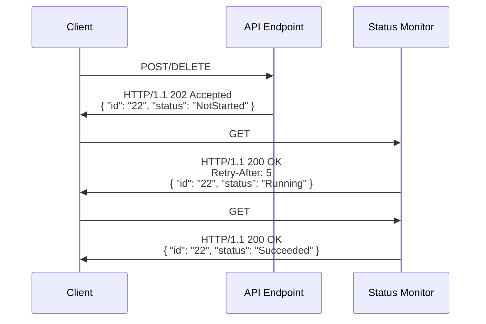

# Considerations for Service Design

<!-- cspell:ignore autorest, etag, idempotency -->

## History

| Date        | Notes                                                          |
| ----------- | -------------------------------------------------------------- |
| 2022-Jul-15 | Update guidance on long-running operations                     |
| 2022-Feb-01 | Updated error guidance                                        |
| 2021-Sep-11 | Add long-running operations guidance                           |
| 2021-Aug-06 | Updated Azure REST Guidelines per Azure API Stewardship Board. |

## Introduction

Great APIs make your service usable to customers. They are intuitive, naturally reflecting and communicating the underlying model and its behavior. They lend themselves easily to client library implementations in multiple programming languages. And they don't "get in the way" of the developer, by remaining stable and predictable, _especially over time_.

This document provides Microsoft teams building Azure services with a set of guidelines that  help service teams build great APIs. The guidelines create APIs that are approachable, sustainable, and consistent across the Azure platform. We do this by applying a common set of patterns and web standards to the design and development of the API.
For developers, a well defined and constructed API enables them to build fault-tolerant applications that are easy to maintain, support, and grow. For Azure service teams, the API is often the source of code generation enabling a broad audience of developers across multiple languages.

Azure Service teams should engage the Azure HTTP/REST Stewardship Board early in the development lifecycle for guidance, discussion, and review of their API. In addition, it is good practice to perform a security review, especially if you are concerned about PII leakage, compliance with GDPR, or any other considerations relative to your situation.

It is critically important to design your service to avoid disrupting users as the API evolves:

:white_check_mark: **DO** implement API versioning starting with the very first release of the service.

:white_check_mark: **DO** ensure that customer workloads never break

:white_check_mark: **DO** ensure that customers are able to adopt a new version of service or SDK client library **without requiring code changes**

## Azure Management Plane vs Data Plane
_Note: Developing a new service requires the development of at least 1 (management plane) API and potentially one or more additional (data plane) APIs.  When reviewing v1 service APIs, we see common advice provided during the review._

A **management plane** API is implemented through the Azure Resource Manager (ARM) and is used to provision and control the operational state of resources.
A **data plane** API is used by developers to implement applications. Occasionally, some operations are useful for provisioning/control and applications. In this case, the operation can appear in both APIs.
Although, best practices and patterns described in this document apply to all HTTP/REST APIs, they are especially important for **data plane** services because it is the primary interface for developers using your service. The **management plane** APIs may have other preferred practices based on [the conventions of the Azure ARM](https://github.com/Azure/azure-resource-manager-rpc).


## Start with the Developer Experience
A great API starts with a well thought out and designed service. Your service should define simple/understandable abstractions with each given a clear name that you use consistently throughout your API and documentation. There must also be an unambiguous relationship between these abstractions.

Follow these practices to create clear names for your abstractions:
- Don't invent fancy terms or use fancy words. Try explaining the abstraction to someone that is not a domain expert and then name the abstraction using similar verbiage.
- Don't include "throwaway" words in names, like "response", "object", "payload", etc.
- Avoid generic names. Names should be specific to the abstraction and highlight how it is different from other abstractions in your service or related services.
- Pick one word/term out of a set of synonyms and stick to it.

It is extremely difficult to create an elegant API that works well on top of a poorly designed service; the service team and customers will live with this pain for years to come. So, the service team should empathize with customers by:
- Building apps that consume the API
- Hold reviews and share what is learned with your team
- Get customer feedback from API previews
- Thinking about the code that a customer writes both before and after an HTTP operation
- Initializing and reading from the data structures your service requires
- Thinking about which errors are recoverable at runtime as opposed to indicating a bug in the customer code that must be fixed

The whole purpose of a preview to address feedback by improving abstractions, naming, relationships, API operations, and so on. It is OK to make breaking changes during a preview to improve the experience now so that it is sustainable long term.

## Focus on Hero Scenarios
It is important to realize that writing an API is, in many cases, the easiest part of providing a delightful developer experience. There are a large number of downstream activities for each API, e.g. testing, documentation, client libraries, examples, blog posts, videos, and supporting customers in perpetuity. In fact, implementing an API is of miniscule cost compared to all the other downstream activities.

_For this reason, it is **much better** to ship with fewer features and only add new features over time as required by customers._

Focusing on hero scenarios reduces development, support, and maintenance costs; enables teams to align and reach consensus faster; and accelerates the time to delivery. A telltale sign of a service that has not focused on hero scenarios is "API drift," where endpoints are inconsistent, incomplete, or juxtaposed to one another.

:white_check_mark: **DO** define "hero scenarios" first including abstractions, naming, relationships, and then define the API describing the operations required

:white_check_mark: **DO** provide example code demonstrating the "Hero Scenarios"

:white_check_mark: **DO** consider how your abstractions will be represented in different high-level languages.

:white_check_mark: **DO** develop code examples in at least one dynamically typed language (for example, Python or JavaScript) and one statically typed language (for example, Java or C#) to illustrate your abstractions and high-level language representations.

:no_entry: **DO NOT** proactively add APIs for speculative features customers might want

### Start with your API Definition
Understanding how your service is used and defining its model and interaction patterns--its API--should be one of the earliest activities a service team undertakes. It reflects the abstractions & naming decisions and makes it easy for developers to implement the hero scenarios.

:white_check_mark: **DO** create an [OpenAPI Definition](https://github.com/OAI/OpenAPI-Specification/blob/main/versions/2.0.md) (with [autorest extensions](https://github.com/Azure/autorest/blob/master/docs/extensions/readme.md)) describing the service. The OpenAPI definition is a key element of the Azure SDK plan and is essential for documentation, usability and discoverability of services.

## Design for Change Resiliency
As you build out your service and API, there are a number of decisions that can be made up front that add resiliency to client implementations. Addressing these as early as possible will help you iterate faster and avoid breaking changes.

:ballot_box_with_check: **YOU SHOULD** use extensible enumerations. Extensible enumerations are modeled as strings - expanding an extensible enumeration is not a breaking change.

:ballot_box_with_check: **YOU SHOULD** implement [conditional requests](https://tools.ietf.org/html/rfc7232) early. This allows you to support concurrency, which tends to be a concern later on.

## Use Previews to Iterate
Before releasing your API plan to invest significant design effort, get customer feedback, & iterate through multiple preview releases. This is especially important for V1 as it establishes the abstractions and patterns that developers will use to interact with your service.

:ballot_box_with_check: **YOU SHOULD**  write and test hypotheses about how your customers will use the API.

:ballot_box_with_check: **YOU SHOULD**  release and evaluate a minimum of 2 preview versions prior to the first GA release.

:ballot_box_with_check: **YOU SHOULD**  identify key scenarios or design decisions in your API that you want to test with customers, and ask customers for feedback and to share relevant code samples.

:ballot_box_with_check: **YOU SHOULD**  consider doing a _code with_ exercise in which you actively develop with the customer, observing and learning from their API usage.

:ballot_box_with_check: **YOU SHOULD**  capture what you have learned during the preview stage and share these findings with your team and with the API Stewardship Board.

## Communicate Deprecations
As your service evolves over time, it will be natural that you want to remove operations that are no longer needed. For example, additional requirements or new capability in your service, may have resulted in a new operation that, effectively, replaces an old one.
Azure has a well established breaking changes policy that describes how to approach these kinds of changes. As part of this policy, the service team is required to clearly communicate to customers when their API is changing, e.g. deprecating operations. Often, this is done via an email to the address that is attached to the Azure subscription.

However, given how many organizations are structured, it's common that this email address is different from the actual people writing code against your API. To address this, the service API should declare that it may return the `azure-deprecating` header, to indicate that this operation will be removed in the future. There is a simple string convention, specied in the [Azure REST API Guidelines](https://aka.ms/azapi/guidelines) that provides more information about the forthcoming deprecation.
This header is targeted at developers or operation professionals, and it is intended to give them enough information and lead time to properly adapt to this change. Your documentation should reference this header and encourage logging and alerting practices based on its presence.

## Avoid Surprises
A major inhibitor to adoption and usage is when an API behaves in an unexpected way. Often, these are subtle design decisions that seem benign at the time, but end up introducing significant downstream friction for developers.

One common area of friction for developers is _polymorphism_ -- where a value may have any of several types or structures.
Polymorphism can be beneficial in certain cases, e.g. as a way to express inheritance, but also creates friction
because it requires the value to be introspected before being processed and cannot be represented in a natural/useful way in many type-safe languages.

:ballot_box_with_check: **YOU SHOULD** avoid polymorphism, especially in the response. An endpoint **SHOULD** work with a single type to avoid problems during SDK creation.

:ballot_box_with_check: **YOU SHOULD** return a homogeneous collection (single type).  Do not return heterogeneous collections unless there is a really good reason to do so. If you feel heterogeneous collections are required, discuss the requirement with an API reviewer prior to implementation.

Collections are another common area of friction for developers. It is important to define collections in a consistent manner within your service and across services of the platform.  In particular, features such as pagination, filtering, and sorting, when supported, should follow common API patterns. See [Collections](./Guidelines.md#collections) for specific guidance.

An important consideration when defining a new service is support for pagination.

:ballot_box_with_check: **YOU SHOULD** support server-side paging, even if your resource does not currently need paging. This avoids a breaking change when your service expands. See [Collections](./Guidelines.md#collections) for specific guidance.

Another consideration for collections is support for sorting the set of returned items with the _orderby_ query parameter.
Sorting collection results can be extremely expensive for a service to implement as it must retrieve all items to sort them. And if the operation supports paging (which is likely), then a client request to get another page may have to retrieve all items and sort them again to determine which items are on the desired page.

:heavy_check_mark: **YOU MAY** support `orderby` if customer scenarios really demand it and the service is confident that it can support it in perpetuity (even if the backing storage service changes someday).

Another important design pattern for avoiding surprises is idempotency. An operation is idempotent if it can be performed multiple times and have the same result as a single execution.
HTTP requires certain operations like GET, PUT, and DELETE to be idempotent, but for cloud services it is important to make _all_ operations idempotent so that clients can use retry in failure scenarios without risk of unintended consequences.
See the [HTTP Request / Response Pattern section of the Guidelines](./Guidelines.md#http-request--response-pattern) for detailed guidance on making operations idempotent.

## Action Operations

Most operations conform to one of the standard REST Create, Read, Update, Delete, or List (CRUDL) style of operations. We refer to all other operations as "action" operations. Some examples of action operations are to reboot a VM, or send an email.

It is good practice to define the path for action operations that is easily distinguished from any resource path of the service. When services allow user-specified resource ids (also a good practice), the recommended approach for this is:
1) constrain user-specified resource ids to allow only certain characters, such as alphanumeric and '-' or '_', and
2) use a special character not in the set of valid characters for resource names to distinguish the "action" in the path.

In Azure we recommend distinguishing action operations by appending a ':' followed by an action verb to the final path segment.  E.g.
```http
https://.../<resource-collection>/<resource-id>:<action>?<input parameters>
```

Other patterns are possible. The key consideration is to ensure that the path for an action operation
cannot collide with a resource path that contains user-specified resource ids.

## Long-Running Operations

Long-running operations are an API design pattern that should be used when the processing of
an operation may take a significant amount of time -- longer than a client will want to block
waiting for the result.

The request that initiates a long-running operation returns a response that points to or embeds
a _status monitor_, which is an ephemeral resource that will track the status and final result of the operation.
The status monitor resource is distinct from the target resource (if any) and specific to the individual
operation request.

A POST or DELETE operation returns a `202 Accepted` response with the status monitor in the response body.
A long-running POST should not be used for resource create -- use PUT as described below.
PATCH must never be used for long-running operations -- it should be reserved for simple resource updates.
If a long-running update is required it should be implemented with POST.

There is a special form of long-running operation initiated with PUT that is described
in [Create (PUT) with additional long-running processing](#create-put-with-additional-long-running-processing).
The remainder of this section describes the pattern for long-running POST and DELETE operations.

This diagram illustrates how a long-running operation with a status monitor is initiated and then how the client
determines it has completed and obtains its results:



1. The client sends the request to initiate the long-running operation.
The initial request could be a POST or DELETE method.
The request may contain an `Operation-Id` header that the service uses as the ID of the status monitor created for the operation.

2. The service validates the request and initiates the operation processing.
If there are any problems with the request, the service responds with a `4xx` status code and error response body.
Otherwise the service responds with a `202-Accepted` HTTP status code.
The response body is the status monitor for the operation including the ID, either from the request header or generated by the service.
When returning a status monitor whose status is not in a terminal state, the response must also include a `retry-after` header indicating the minimum number of seconds the client should wait
before polling (GETing) the status monitor URL again for an update.
For backward compatibility, the response may also include an `Operation-Location` header containing the absolute URL
of the status monitor resource (without an api-version query parameter).

3. After waiting at least the amount of time specified by the previous response's `Retry-after` header,
the client issues a GET request to the status monitor using the ID in the body of the initial response.
The GET operation for the status monitor is documented in the REST API definition and the ID
is the last URL path segment.

4. The status monitor responds with information about the operation including its current status,
which should be represented as one of a fixed set of string values in a field named `status`.
If the operation is still being processed, the status field will contain a "non-terminal" value, like `NotStarted` or `Running`.

5. After the operation processing completes, a GET request to the status monitor returns the status monitor with a status field set to a terminal value -- `Succeeded`, `Failed`, or `Canceled` -- that indicates the result of the operation.
If the status is `Failed`, the status monitor resource contains an `error` field with a `code` and `message` that describes the failure.
If the status is `Succeeded` and the LRO is an Action operation, the operation results will be returned in the `result` field of the status monitor.
If the status is `Succeeded` and the LRO is an operation on a resource, the client can perform a GET on the resource
to observe the result of the operation if desired.

6. There may be some cases where a long-running operation can be completed before the response to the initial request.
In these cases, the operation should still return a `202 Accepted` with the `status` property set to the appropriate terminal state.

7. The service is responsible for purging the status-monitor resource.
It should auto-purge the status monitor resource after completion (at least 24 hours).
The service may offer DELETE of the status monitor resource due to GDPR/privacy.

### Long-running Action Operations

An action operation that is also long-running combines the [Action Operations](#action-operations) pattern
with the [Long Running Operations](#long-running-operations) pattern.

The operation is initiated with a POST operation and the operation path ends in `:<action>`.

```text
POST /<service-or-resource-url>:<action>?api-version=2022-05-01
Operation-Id: 22 
 
{ 
   "arg1": 123 
   "arg2": "abc" 
} 
```

The response is a `202 Accepted` as described above.

```text
HTTP/1.1 202 Accepted
Operation-Location: https://<status-monitor-endpoint>/22
 
{
   "id": "22",
   "status": "NotStarted"
}
```

The client will issue a GET to the status monitor to obtain the status and result of the operation.

```text
GET https://<status-monitor-endpoint>/22?api-version=2022-05-01
```

When the operation completes successfully, the result (if there is one) will be included in the `result` field of the status monitor.

```text
HTTP/1.1 200 OK
 
{
   "id": "22",
   "status": "Succeeded",
   "result": { ... }
}
```

### PUT with additional long-running processing

A special case of long-running operation that occurs often is a PUT operation to create or replace a resource
that involves some additional long-running processing.
One example is a resource requires physical resources (e.g. servers) to be "provisioned" to make the resource functional.
In this case, the request may contain an `Operation-Id` header that the service will use as
the ID of the status monitor created for the operation.

```text
PUT /items/FooBar&api-version=2022-05-01
Operation-Id: 22

{
   "prop1": 555, 
   "prop2": "something"
}
```

In this case the response to the initial request is a `201 Created` to indicate that the resource has been created
or `200 OK` when the resource was replaced.
The response body contains a representation of the created resource, which is the standard pattern for a create operation.
A status monitor is created to track the additional processing and the ID of the status monitor
is returned in the `Operation-Id` header of the response.
The response may also include an `Operation-Location` header for backward compatibility.
If the resource supports ETags, the response may contain an `etag` header and possibly an `etag` property in the resource.

```text
HTTP/1.1 201 Created 
Operation-Id: 22
Operation-Location: https://items/operations/22
etag: "123abc"

{
  "id": "FooBar", 
  "etag": "123abc",
  "prop1": 555,
  "prop2": "something"
}
```

The client will issue a GET to the status monitor to obtain the status of the operation performing the additional processing.

```text
GET https://items/operations/22?api-version=2022-05-01
```

When the additional processing completes, the status monitor will indicate if it succeeded or failed.

```text
HTTP/1.1 200 OK
 
{
   "id": "22",
   "status": "Succeeded"
}
```

If the additional processing failed, the service may delete the original resource if it is not usable in this state,
but would have to clearly document this behavior.

### Long-running delete operation

A long-running delete operation follows the general pattern of a long-running operation --
it returns a `202 Accepted` with a status monitor which the client uses to determine the outcome of the delete.

The resource being deleted should remain visible (returned from a GET) until the delete operation completes successfully.

When the delete operation completes successfully, a client must be able to create new resource with same name without conflicts.

### Controlling a long-running operation

It might be necessary to support some control action on a long-running operation, such as cancel.
This is implemented as a POST on the status monitor endpoint with `:<action>` added.

```text
POST /<status-monitor-url>:cancel?api-version=2022-05-01
```

A successful response to a control operation should be a `200 OK` with a representation of the status monitor.

```text
HTTP/1.1 200 OK 
 
{
   "id": "22",
   "status": "Canceled"
}
```

## Errors
One of the most important parts of service design is also one of the most overlooked.  The errors returned by your service are a critical part of your developer experience and are part of your API contract.  Your service and your customer's application together form a distributed system.  Errors are inevitable, but well-designed errors can help you avoid costly customer support incidents by empowering customers to self-diagnose problems.

First, you should always try to design errors out of existence if possible.  You'll get a lot of this for free by following the [API Guidelines](https://aka.ms/azapi/guidelines).  Some examples include:
- Idempotent APIs solve a whole class of network issues where customers have no idea how to proceed if they send a request to the service but never get a response.
- Accessing resources from multiple microservices can quickly lead to complex race conditions. These can be avoided by supporting conditional requests through an [optimistic concurrency strategy](https://github.com/microsoft/api-guidelines/blob/vNext/azure/Guidelines.md#optimistic-concurrency), e.g. by leveraging `If-Match`/`If-None-Match` request headers.
- Reframing the purpose of an API can obviate some errors.  This is most often specific to your operations, but an [example from the API Guidelines](https://github.com/microsoft/api-guidelines/blob/vNext/azure/Guidelines.md#http-return-codes) is thinking about `DELETE`s as _"ensure no resource at this location exists"_ so they can return an easier to use `204` instead of _"delete this exact resource instance"_ which would fail with a `404`.

There are two types of errors returned from your service and customers handle them differently.
- Usage errors where the customer is calling your API incorrectly.  The customer can easily make these errors go away by fixing their code.  We expect most usage errors to be found during testing.
- Runtime errors that can't be prevented by the customer and need to be recovered from.  Some runtime errors like `429` throttling will be handled automatically by client libraries, but most will be situations like a `409` conflict requiring knowledge about the customer's application to remedy.

You should use appropriate [HTTP status codes](https://developer.mozilla.org/docs/Web/HTTP/Status#client_error_responses) for customers to handle errors generically and error code strings in our common error schema and the `x-ms-error-code` header for customers to handle errors specifically.  As an example, consider what a customer would do when trying to get the properties of a Storage blob:
- A `404` status code tells them the blob doesn't exist and the customer can report the error to their users
- A `BlobNotFound` or `ContainerNotFound` error code will tell them why the blob doesn't exist so they can take steps to recreate it

The [common error schema in the Guidelines](https://github.com/microsoft/api-guidelines/blob/vNext/azure/Guidelines.md#handling-errors) allows nested details and inner errors that have their own error codes, but the top-level error code is the most important.  The HTTP status code and the top-level error code are the only part of your error that we consider part of your API contract that follows the same compatibility requirements as the rest of your API.
Importantly, this means you **changing the HTTP status code or top-level error code for an API is a breaking change**.
You can only return new status codes and error codes in future API versions if customers make use of new features that trigger new classes of errors.  Battle tested error handling is some of the hardest code to get right and we can't break that for customers when they upgrade to the latest version.  The rest of the properties in your error like `message`, `details`, etc., are not considered part of your API contract and can change to improve the diagnosability of your service.

You should also return the top-level error code as the `x-ms-error-code` response header so client libraries have the ability to automatically retry requests when possible without having to parse a JSON payload.  We recommend unique error codes like `ContainerBeingDeleted` for every distinct recoverable error that can occur, but suggest reusing common error codes like `InvalidHeaderValue` for usage errors where a descriptive error message is more important for resolving the problem.
The Storage [Common](https://docs.microsoft.com/rest/api/storageservices/common-rest-api-error-codes) and [Blob](https://docs.microsoft.com/rest/api/storageservices/blob-service-error-codes) error codes are a good starting point if you're looking for examples.
You can [define an enum in your spec](https://github.com/Azure/azure-rest-api-specs/blob/main/specification/storage/data-plane/Microsoft.BlobStorage/preview/2021-04-10/blob.json#L10419) with `"modelAsString": true` that lists all of the top-level error codes to make it [easier for your customers to handle specific error codes](https://github.com/Azure/azure-sdk-for-net/tree/main/sdk/storage/Azure.Storage.Blobs#troubleshooting).

You should not document specific error status codes in your OpenAPI/Swagger spec.  The `"default"` response is the only thing AutoRest considers an error response unless you provide other annotations.  Every unique status code turns into a separate code path in your client libraries so we do not encourage this practice.  The only reason to document specific error status codes is if they return a different error response than the default, but that is also heavily discouraged.

Be as precise as possible when writing error messages.  A message with just `Invalid Argument` is almost useless to a customer who sent 100KB of JSON to your endpoint.  ``Query parameter `top` must be less than or equal to 1000`` tells a customer exactly what went wrong so they can quickly fix the problem.
Don't go overboard while writing great, understandable error messages and include any sensitive customer information or secrets though.  Many developers will blindly write any error to logs that don't have the same level of access control as Azure resources.

All responses should include the `x-ms-request-id` header with a unique id for the request, but this is particularly important for error responses.  Service logs for the request should contain the `x-ms-request-id` so that support staff can use this value to diagnose specific customer reported errors.

Finally, write sample code for your service's workflow and add the code you'd want customers using to gracefully recover from errors.  Is it actually graceful?  Is it something you'd be comfortable asking most customers to write?
We also highly encourage reaching out to customers during private preview and asking them for code they've written against your service.  Their error handling might match your expectations, you might find a strong need for better documentation, or you might find important opportunities to improve the errors you're returning.

## Pagination

Operations that return a collection of resources must consider pagination.
There are hard limits to the payload size of HTTP responses, and when the size of a collection or the resources themselves
can grow arbitrarily large there is the risk of exceeding this limit if the operation does not support pagination.
Further, adding support for pagination is a breaking change so it should be supported in the initial GA of the service
if there is any possibility that it will eventually be needed.

There are two forms of pagination that MAY be supported by RESTful APIs.
Server-driven paging mitigates against denial-of-service attacks by forcibly paginating a request over multiple response payloads.
Client-driven paging enables clients to request only the number of resources that it can use at a given time.
Services should almost always support server-driven paging and may optionally support client-driven paging.

### Server-driven paging

In server-driven paging, the service includes a `nextLink` property in the response to indicate that additional elements
exist in the collection.
The value of the `nextLink` property should be an opaque absolute URL that will return the next page of results.
The absence of a `nextLink` property means that no additional pages are available.
Since `nextLink` is an opaque URL it should include any query parameters required by the service, including `api-version`.
The service should honor a request to a URL derived from `nextLink` by replacing the value for the `apl-version` query parameter
with a different but valid api version. The service may reject the request if any other element of `nextLink` was modified.

The service determines how many items to include in the response and may choose a different number for different collections and even for different pages of the same collection.
An operation may allow the client to specify a maximum number of items in a response with an optional `maxpagesize` parameter.
Operations that support `maxpagesize` should return no more than the value specified in `maxpagesize` but may return fewer.

### Client-driven paging

An operation may support `skip` and `top` query parameters to allow the client to specify an offset into the collection
and the number of results to return, respectively.

Note that when `top` specifies a value larger than the server-driven paging page size, the response will be paged accordingly.

## Getting Help: The Azure REST API Stewardship Board
The Azure REST API Stewardship board is a collection of dedicated architects that are passionate about helping Azure service teams build interfaces that are intuitive, maintainable, consistent, and most importantly, delight our customers. Because APIs affect nearly all downstream decisions, you are encouraged to reach out to the Stewardship board early in the development process. These architects will work with you to apply these guidelines and identify any hidden pitfalls in your design.

### Typical Review Session
When engaging with the API REST Stewardship board, your working sessions will generally focus on three areas:
- Correctness - Your service should leverage the proper HTTP verbs, return codes, and respect the core constructs of a REST API, e.g. idempotency, that are standard throughout the industry.
- Consistency - Your services should look and behave as though they are natural part of the Azure platform.
- Well formed - Do your services adhere to REST and Azure standards, e.g. proper return codes, use of headers.
- Durable - Your APIs will grow and change over time and leveraging the common patterns described in this document will help you minimize your tech debt and move fast with confidence.

It was once said that "all roads lead to Rome." For cloud services, the equivalent might be that "all 'roads' start with your API." That could not be more true than at Microsoft, where client libraries, documentation, and many other artifacts all originate from the fundamental way you choose to expose your service.
With careful consideration at the outset of your development effort, the architectural stewardship of the API board, and the thoughtful application of these guidelines, you will be able to produce a consistent, well formed API that will delight our customers.
