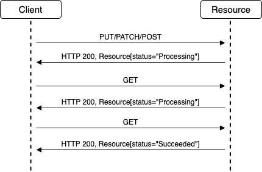
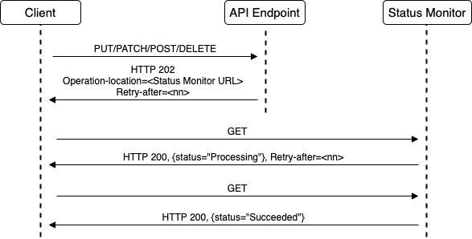

# Considerations for Service Design

## History

| Date        | Notes                                                          |
| ----------- | -------------------------------------------------------------- |
| 2021-Sep-11 | Add long-running operations guidance                           |
| 2021-Aug-06 | Updated Azure REST Guidelines per Azure API Stewardship Board. |

## Introduction

Great APIs make your service usable to customers. They are intuitive, naturally reflecting and communicating the underlying model and its behavior. They lend themselves easily to client library implementations in multiple programming languages. And they don't "get in the way" of the developer, by remaining stable and predictable, _especially over time_.

This document provides Microsoft teams building Azure services with a set of guidelines that  help service teams build great APIs. The guidelines create APIs that are approachable, sustainable, and consistent across the Azure platform. We do this by applying a common set of patterns and web standards to the design and development of the API.
For developers, a well defined and constructed API enables them to build fault-tolerant applications that are easy to maintain, support, and grow. For Azure service teams, the API is often the source of code generation enabling a broad audience of developers across multiple languages.

Azure Service teams should engage the Azure HTTP/REST Stewardship Board early in the development lifecycle for guidance, discussion, and review of their API. In addition, it is good practice to perform a security review, especially if you are concerned about PII leakage, compliance with GDPR, or any other considerations relative to your situation.

It is critically important to design your service to avoid disrupting users as the API evolves:

:white_check_mark: **DO** implement API versioning starting with the very first release of the service.

:white_check_mark: **DO** ensure that customer workloads never break

:white_check_mark: **DO** ensure that customers are able to adopt a new version of service or SDK client library **without requiring code changes**

## Azure Management Plane vs Data Plane
*Note: Developing a new service requires the development of at least 1 (management plane) API and potentially one or more additional (data plane) APIs.  When reviewing v1 service APIs, we see common advice provided during the review.*

A **management plane** API is implemented through the Azure Resource Manager (ARM) and is used to provision and control the operational state of resources.
A **data plane** API is used by developers to implement applications. Occasionally, some operations are useful for provisioning/control and applications. In this case, the operation can appear in both APIs.
Although, best practices and patterns described in this document apply to all HTTP/REST APIs, they are especially important for **data plane** services because it is the primary interface for developers using your service. The **management plane** APIs may have other preferred practices based on [the conventions of the Azure ARM](https://github.com/Azure/azure-resource-manager-rpc).

## Start with the Developer Experience
A great API starts with a well thought out and designed service. Your service should define simple/understandable abstractions with each given a clear name that you use consistently throughout your API and documentation. There must also be an unambiguous relationship between these abstractions.

Follow these practices to create clear names for your abstractions:
- Don't invent fancy terms or use fancy words. Try explaining the abstraction to someone that is not a domain expert and then name the abstraction using similar verbage.
- Don't include "throwaway" words in names, like "response", "object", "payload", etc.
- Avoid generic names. Names should be specific to the abstraction and highlight how it is different from other abstractions in your service or related services.
- Pick one word/term out of a set of synonyms and stick to it.

It is extremely difficult to create an elegant API that works well on top of a poorly designed service; the service team and customers will live with this pain for years to come. So, the service team should empathize with customers by:
- Building apps that consume the API
- Hold reviews and share what is learned with your team
- Get customer feedback from API previews
- Thinking about the code that a customer writes both before and after an HTTP operation
- Initializing and reading from the data structures your service requires
- Thinking about which errors are recoverable at runtime as opposed to indicating a bug in the customer code that must be fixed

The whole purpose of a preview to address feedback by improving abstractions, naming, relationships, API operations, and so on. It is OK to make breaking changes during a preview to improve the experience now so that it is sustainable long term.

## Focus on Hero Scenarios
It is important to realize that writing an API is, in many cases, the easiest part of providing a delightful developer experience. There are a large number of downstream activities for each API, e.g. testing, documentation, client libraries, examples, blog posts, videos, and supporting customers in perpetuity. In fact, implementing an API is of miniscule cost compared to all the other downstream activities.

*For this reason, it is **much better** to ship with fewer features and only add new features over time as required by customers.*

Focusing on hero scenarios reduces development, support, and maintenance costs; enables teams to align and reach consensus faster; and accelerates the time to delivery. A telltale sign of a service that has not focused on hero scenarios is "API drift," where endpoints are inconsistent, incomplete, or juxtaposed to one another.

:white_check_mark: **DO** define "hero scenarios" first including abstractions, naming, relationships, and then define the API describing the operations required

:white_check_mark: **DO** provide example code demonstrating the "Hero Scenarios"

:white_check_mark: **DO** consider how your abstractions will be represented in different high-level languages.

:white_check_mark: **DO** develop code examples in at least one dynamically typed language (for example, Python or JavaScript) and one statically typed language (for example, Java or C#) to illustrate your abstractions and high-level language representations.

:no_entry: **DO NOT** proactively add APIs for speculative features customers might want

### Start with your API Definition
Understanding how your service is used and defining its model and interaction patterns--its API--should be one of the earliest activities a service team undertakes. It reflects the abstractions & naming decisions and makes it easy for developers to implement the hero scenarios.

:white_check_mark: **DO** create an [OpenAPI Definition](https://github.com/OAI/OpenAPI-Specification/blob/main/versions/2.0.md) (with [autorest extensions](https://github.com/Azure/autorest/blob/master/docs/extensions/readme.md)) describing the service. The OpenAPI definition is a key element of the Azure SDK plan and is essential for documentation, usability and discoverability of services.

## Use Previews to Iterate
Before releasing your API plan to invest significant design effort, get customer feedback, & iterate through multiple preview releases. This is especially important for V1 as it establishes the abstractions and patterns that developers will use to interact with your service.

:ballot_box_with_check: **YOU SHOULD**  write and test hypotheses about how your customers will use the API.

:ballot_box_with_check: **YOU SHOULD**  release and evaluate a minimum of 2 preview versions prior to the first GA release.

:ballot_box_with_check: **YOU SHOULD**  identify key scenarios or design decisions in your API that you want to test with customers, and ask customers for feedback and to share relevant code samples.

:ballot_box_with_check: **YOU SHOULD**  consider doing a *code with* exercise in which you actively develop with the customer, observing and learning from their API usage.

:ballot_box_with_check: **YOU SHOULD**  capture what you have learned during the preview stage and share these findings with your team and with the API Stewardship Board.

## Avoid Surprises
A major inhibitor to adoption and usage is when an API behaves in an unexpected way. Often, these are subtle design decisions that seem benign at the time, but end up introducing significant downstream friction for developers.

One common area of friction for developers is _polymorphism_ -- where a value may have any of several types or structures.
Polymorphism can be beneficial in certain cases, e.g. as a way to express inheritance, but also creates friction
because it requires the value to be introspected before being processed and cannot be represented in a natural/useful way in many type-safe languages.

:ballot_box_with_check: **YOU SHOULD** avoid polymorphism, especially in the response. An endpoint **SHOULD** work with a single type to avoid problems during SDK creation.

:ballot_box_with_check: **YOU SHOULD** return a homogeneous collection (single type).  Do not return heterogeneous collections unless there is a really good reason to do so. If you feel heterogeneous collections are required, discuss the requirement with an API reviewer prior to implementation.

Collections are another common area of friction for developers. It is important to define collections in a consistent manner within your service and across services of the platform.  In particular, features such as pagination, filtering, and sorting, when supported, should follow common API patterns. See [Collections](./Guidelines.md#collections) for specific guidance.

An important consideration when defining a new service is support for pagination.

:ballot_box_with_check: **YOU SHOULD** support server-side paging, even if your resource does not currently need paging. This avoids a breaking change when your service expands. See [Collections](./Guidelines.md#collections) for specific guidance.

Another consideration for collections is support for sorting the set of returned items with the _orderby_ query parameter.
Sorting collection results can be extremely expensive for a service to implement as it must retrieve all items to sort them. And if the operation supports paging (which is likely), then a client request to get another page may have to retrieve all items and sort them again to determine which items are on the desired page.

:heavy_check_mark: **YOU MAY** support `orderby` if customer scenarios really demand it and the service is confident that it can support it in perpetuity (even if the backing storage service changes someday).

Another important design pattern for avoiding surprises is idempotency. An operation is idempotent if it can be performed multiple times and have the same result as a single execution.
HTTP requires certain operations like GET, PUT, and DELETE to be idempotent, but for cloud services it is important to make _all_ operations idempotent so that clients can use retry in failure scenarios without risk of unintended consequences.
See the [HTTP Request / Response Pattern section of the Guidelines](./Guidelines.md#http-request--response-pattern) for detailed guidance on making operations idempotent.

## Design for Change Resiliency
As you build out your service and API, there are a number of decisions that can be made up front that add resiliency to client implementations. Addressing these as early as possible will help you iterate faster and avoid breaking changes.

:ballot_box_with_check: **YOU SHOULD** use extensible enumerations. Extensible enumerations are modeled as strings - expanding an extensible enumeration is not a breaking change.

:ballot_box_with_check: **YOU SHOULD** implement [conditional requests](https://tools.ietf.org/html/rfc7232) early. This allows you to support concurrency, which tends to be a concern later on.

## Long-Running Operations

Long-running operations are an API design pattern that should be used when the processing of
an operation may take a significant amount of time -- longer than a client will want to block
waiting for the result.
Azure allows for two forms of this design pattern: resource-based long-running operations (RELO),
which is the preferred pattern, and long-running operations with a status monitor.

In both patterns, the processing of the operation is initiated by one API call and the client
obtains the results of the operation from a subsequent API call.
Here we illustrate the sequence of API calls involved in each of these patterns.

### Resource-based long-running operations

In the RELO pattern, the resource that is the target of the operation contains a `status` field
that holds the status of an outstanding or last completed operation.
This means that the client can use a standard "get" operation on the resource to determine the
status of an operation it initiated. The flow looks like this:

<!-- markdownlint-disable MD033 -->

  

<!-- markdownlint-enable MD033 -->

1. The client sends the initial request to the resource to initiate the long-running operation.
This initial request could be a PUT, PATCH, POST, or DELETE method.

2. The resource validates the request and initiates the operation processing.
It sends a response to client with a `200-OK` HTTP status code (or `201-Created` if the operation
is a create operation) and a representation of the resource where the `status` field is set
to a value indicating that the operation processing has been started.

3. The client then issues a GET request to the resource to determine if the operation processing
has completed.

4. The resource responds with a representation of the resource. While the operation is still being
processed, the status field will contain a "non-terminal" value, like `Processing`.

5. After the operation processing has completed, a GET request from the client will receive a response
where the status field contains a "terminal" value -- `Succeeded`, `Failed`, or `Canceled` --
that indicates the result of the operation.

A resource may support multiple outstanding RELO operations, where the status field of the resource
indicates the combined status of the outstanding operations.
If a new operation request is received when there is already a long-running operation in progress for a resource,
the service should reject the operation if it is inconsistent with one already in progress.
However, if the new operation is redundant or not inconsistent with the one in progress,
for example a "reboot" operation on a VM that is in the process of rebooting, then the service should
accept the request. The status field of the resource should then report the completion status of _both_
operations.

Note: The RELO pattern should not be used in cases where the completion status of individual operations
may be important to users, as opposed to simply learning that an operation of the type they requested
(e.g. create a resource with a specific name) has successfully completed.

### Long-running operations with status monitor

In the LRO with status monitor pattern, the status and results of the operation are encapsulated into
a status monitor resource that is distinct from the target resource and specific to the individual
operation request.  Here's what the status monitor LRO pattern looks like:

<!-- markdownlint-disable MD033 -->

  

<!-- markdownlint-enable MD033 -->

1. The client sends the request to initiate the long-running operation.
As in the RELO pattern, the initial request could be a PUT, PATCH, POST, or DELETE method.

2. The resource validates the request and initiates the operation processing.
It sends a response to the client with a `202-Accepted` HTTP status code.
Included in this response is an `Operation-location` response header with the absolute URL of
status monitor for this specific operation.
The response also includes a `Retry-after` header telling the client a minimum time to wait (in seconds)
before sending a request to the status monitor URL.

3. After waiting at least the amount of time specified by the previous response's `Retry-after` header,
the client issues a GET request to the status monitor URL.

4. The status monitor URL responds with information about the operation including its current status,
which should be represented as one of a fixed set of string values in a field named `status`.
If the operation is still being processed, the status field will contain a "non-terminal" value, like `Processing`.

5. After the operation processing completes, a GET request to status monitor URL returns a response with a status field containing a terminal value -- `Succeeded`, `Failed`, or `Canceled` -- that indicates the result of the operation.
If the status is `Failed`, the status monitor resource must contain an `error` field with a `code` and `message` that describes the failure.
If the status is `Succeeded`, the response may contain additional fields as appropriate, such as results
of the operation processing.

An important distinction between RELO and status monitor LROs is that there is a unique status monitor for each
status monitor LRO, whereas the status of all RELO operations is combined into the status of the resource.
So status monitor LROs are "one-to-one" with their operation status, whereas RELO-style LROs are "many-to-one".

## Getting Help: The Azure REST API Stewardship Board
The Azure REST API Stewardship board is a collection of dedicated architects that are passionate about helping Azure service teams build interfaces that are intuitive, maintainable, consistent, and most importantly, delight our customers. Because APIs affect nearly all downstream decisions, you are encouraged to reach out to the Stewardship board early in the development process. These architects will work with you to apply these guidelines and identify any hidden pitfalls in your design.

### Typical Review Session
When engaging with the API REST Stewardship board, your working sessions will generally focus on three areas:
- Correctness - Your service should leverage the proper HTTP verbs, return codes, and respect the core constructs of a REST API, e.g. idempotency, that are standard throughout the industry.
- Consistency - Your services should look and behave as though they are natural part of the Azure platform.
- Well formed - Do your services adhere to REST and Azure standards, e.g. proper return codes, use of headers.
- Durable - Your APIs will grow and change over time and leveraging the common patterns described in this document will help you minimize your tech debt and move fast with confidence.

It was once said that "all roads lead to Rome." For cloud services, the equivalent might be that "all 'roads' start with your API." That could not be more true than at Microsoft, where client libraries, documentation, and many other artifacts all originate from the fundamental way you choose to expose your service.
With careful consideration at the outset of your development effort, the architectural stewardship of the API board, and the thoughtful application of these guidelines, you will be able to produce a consistent, well formed API that will delight our customers.
