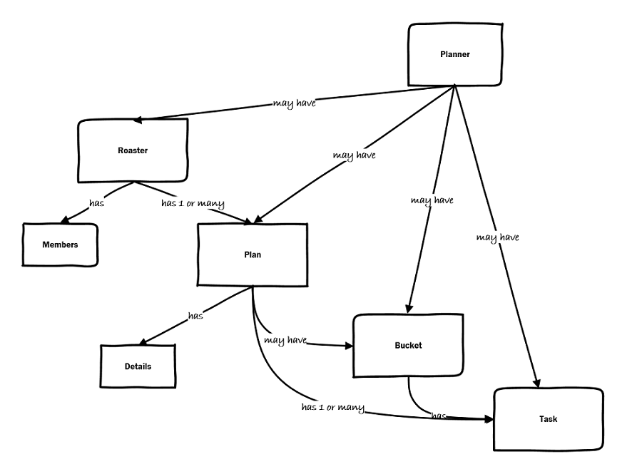

# Microsoft Graph REST API Guidelines

Table of contents

- [Microsoft Graph REST API Guidelines](#microsoft-graph-rest-api-guidelines)
  - [Introduction](#introduction)
    - [Legend](#legend)
  - [Design approach](#design-approach)
    - [Naming](#naming)
    - [Uniform Resource Locators (URLs)](#uniform-resource-locators-urls)
    - [Resource modeling patterns](#resource-modeling-patterns)
      - [Pros and cons](#pros-and-cons)
      - [Nullable properties](#nullable-properties)
    - [Query support](#query-support)
    - [Behavior modeling](#behavior-modeling)
    - [Error handling](#error-handling)
  - [External standards](#external-standards)
  - [API contract and nonbackward compatible changes](#api-contract-and-nonbackward-compatible-changes)
    - [Versioning and deprecation](#versioning-and-deprecation)
  - [Recommended API design patterns](#recommended-api-design-patterns)
  - [References](#references)


## Introduction

When building a digital ecosystem API usability becomes a business priority. The success of your ecosystem depends on APIs that are easy to discover, simple to use, fit for purpose, and consistent across your products.

This document offers guidance that Microsoft Graph API producer teams MUST follow to
ensure that Microsoft Graph has a consistent and easy-to-use API surface. A new API design SHOULD meet the following goals:

- Be developer friendly by using consistent naming, patterns, and web standards (HTTP, REST, JSON).

- Work well with SDKs in many programming languages.

- Be sustainable and evolvable by using clear API contracts.

The Microsoft Graph REST API Guidelines consist of a concise overview document, a collection of articles on Graph standards, and a library of patterns that provide best practices for resolving common API design problems. Together, these documents serve as the means by which API teams discuss and come to consensus on API review requirements.

Technology and software are constantly changing and evolving, and as such, this document is intended to be a living document. API guidelines that change frequently lead to an uneven and inconsistent API surface.Therefore, the general principles and directions that this document offers will be more stable than the specific recommendations for areas that are new or significantly different. The guidance might change as needed to address new scenarios and to clarify existing guidance. The guidance might change as needed to address new scenarios and to clarify existing guidance. To suggest a change or propose a new idea,
[open an issue](https://github.com/microsoft/api-guidelines/issues/new/choose).

### Legend

This document offers prescriptive guidance labeled as follows:

:heavy_check_mark: **MUST** satisfy this specification.

:no_entry: **MUST NOT** use this pattern.

:ballot_box_with_check: **SHOULD** fulfill this specification.

:warning: **SHOULD NOT** adopt this pattern.

If you do not follow this advice, you MUST disclose your reasons during the Microsoft Graph API review.

## Design approach

The design of your API is arguably the most important investment you'll make. API design is what creates the first impression for developers when they discover and learn how to use your APIs. We promote an API-first design approach where you begin your product design by focusing on how information is exchanged and represented and by creating an interface contract for your API, which is followed by design and implementation of the backing service. This approach ensures decoupling of the interface from your implementation and is essential for agility, predictability, and reuse of your APIs.

An established interface contract allows developers to use your API while internal teams are still working on implementation; API specifications enable designing user experience and test cases in parallel. Starting with user-facing contracts also promotes a good understanding of system interactions, your modeling domain, and an understanding of how the service will evolve.

Microsoft Graph supports resource and query-based API styles that follow HTTP, REST, and JSON standards, where the API contract is described by using OData conventions and schema definitions. For more information, see [Documentation · OData Version 4.01](https://www.odata.org/documentation/).

In general, API design includes the following steps:

1. Outline the key current and future scenarios for API consumers.
  
1. Define your domain model.

1. Derive and name your API resources.
  
1. Describe relationships between resources.

1. Determine required behavior.

1. Determine user roles and application permissions.

1. Specify errors.

When creating your API contract, you define resources based on the domain model supporting your service and identify interactions based on user scenarios. Good API design goes beyond modeling the current state of resources. It's important to plan ahead how the API evolves; to do this, it's essential to understand and document your user scenarios as the foundation of the API design. There's no one-to-one correspondence between domain model elements and API resources because you SHOULD simplify your customer facing APIs for better usability and to obfuscate implementation details.

We recommend creating a simple resource diagram like the following to show resources and their relationships and make it easier to reason about modeling choices and the shape of your API.



After you define your resources, it’s time to think about the behavior of your API, which can be expressed via HTTP methods and operational resources such as functions and actions. As you think about API behavior, you identify a happy path and various exceptions and deviations that are expressed as errors and represented by using HTTP codes and error messages.

At every step of your design, you need to consider security, privacy, and compliance as intrinsic components of your API implementation.

### Naming

API resources are typically described by nouns. Resource and property names appear in API URLs and payloads and MUST be descriptive and easy to understand. Ease of understanding comes from familiarity and recognition; therefore, when thinking about naming, you SHOULD favor consistency with other Microsoft Graph APIs, names in the product user interface, and industry standards. Microsoft Graph naming conventions follow the [Naming guidelines](./articles/naming.md).

Following is a short summary of the most often used conventions.

| Requirements                                                            | Example                       |
| ------------------------------------------------------------------------|-------------------------------|
| :no_entry: **MUST NOT** use redundant words in names.                   | - **Right:** /places/{id}/**displayName** or /phones/{id}/**number** <BR> -  **Wrong:** /places/{id}/**placeName** or /phones/{id}/**phoneNumber** |
| :warning: **SHOULD NOT** use brand names in type or property names.     | - **Right:** chat   <BR> -  **Wrong:** teamsChat <BR> - **NOTE:** there is an exception for resources that *only* exist under the `/admin` root segment and the `/users/{userId}/settings` path.  |
| :warning: **SHOULD NOT** use acronyms or abbreviations unless they are broadly understood. | - **Right:** url or htmlSignature <BR> - **Wrong:** msodsUrl or dlp |
| :heavy_check_mark: **MUST** use singular nouns for type names.          | - **Right:** address  <BR> - **Wrong:** addresses  |
| :heavy_check_mark: **MUST** use plural nouns for collections (for listing type or collection properties). | - **Right:** addresses <BR> - **Wrong:** address |
| :ballot_box_with_check: **SHOULD** pluralize the noun even when followed by an adjective (a *postpositive*).| - **Right:** passersby or mothersInLaw    <BR> -  **Wrong:** notaryPublics or motherInLaws |
| **CASING** | |
| :heavy_check_mark: **MUST** use lower camel case for *all* names and namespaces.   | - **Right:** automaticRepliesStatus <BR> - **Wrong:** kebab-case or snake_case |
| :ballot_box_with_check: **SHOULD** case two-letter acronyms with the same case.   | - **Right:** ioLimit or totalIOAmount <BR> - **Right:** 'id' properties similar to driveId or applicationId <BR> - **Wrong:** iOLimit or totalIoAmount|
| :ballot_box_with_check: **SHOULD** case `id` properties the same as a normal word.   | - **Right:** id or fileId <BR> - **Wrong:** ID or fileID |
| :ballot_box_with_check: **SHOULD** case three+ letter acronyms the same as a normal word.  | - **Right:** fidoKey or oauthUrl <BR> - **Wrong:** webHTML |
| :no_entry: **MUST NOT** capitalize the word following a [prefix](https://www.thoughtco.com/common-prefixes-in-english-1692724) or words within a [compound word](http://www.learningdifferences.com/Main%20Page/Topics/Compound%20Word%20Lists/Compound_Word_%20Lists_complete.htm).                                     | - **Right:** subcategory, geo coordinate, or crosswalk <BR> - **Wrong:** metaData, semiCircle, or airPlane |
| :heavy_check_mark: **MUST** capitalize within hyphenated and open (spaced) compound words. | - **Right:** fiveYearOld, daughterInLaw, or postOffice <BR> - **Wrong:** paperclip or fullmoon |
| **PREFIXES AND SUFFIXES** | |
| :heavy_check_mark: **MUST** suffix date and time properties with Date, Time, or DateTime  | - **Right:** dueDate—an Edm.Date <BR> - **Right:** recurringMeetingTime—an Edm.TimeOfDay <BR> - **Right:** createdDateTime—an Edm.DateTimeOffset <BR>- **Wrong:** dueOn or startTime <BR> - **Right:** Instead, both of the preceding are an Edm.DateTimeOffset |
| :ballot_box_with_check: **SHOULD** use the Duration type for durations, but if using an `int`, append the units. | - **Right:** passwordValidityPeriod—an Edm.Duration <BR> - **Right:** passwordValidityPeriodInDays — an Edm.Int32 (use of Edm.Duration type is preferable) <BR>- **Wrong:** passwordValidityPeriod — an Edm.Int32 |
| :no_entry: **MUST NOT** use suffix property names with primitive type names unless the type is temporal. | - **Right:** isEnabled or amount <BR> - **Wrong:** enabledBool |
| :ballot_box_with_check: **SHOULD** prefix property names for properties concerning a different entity.   | - **Right:** siteWebUrl on driveItem or userId on auditActor <BR> - **Wrong:** webUrl on contact when it's the companyWebUrl |
| :ballot_box_with_check: **SHOULD** prefix Boolean properties with `is`, unless this leads to awkward or unnatural sounding names for Boolean properties. | - **Right:** isEnabled or isResourceAccount <BR>- **Wrong:** enabled or allowResourceAccount <BR> - **Right:** allowNewTimeProposals or allowInvitesFrom (subjectively more natural than the following examples) <BR> - **Wrong:** isNewTimeProposalsAllowed or isInvitesFromAllowed (subjectively more awkward that the preceding examples) |
| :no_entry: **MUST NOT** use collection, response, or request suffixes.  | - **Right:** addresses <BR> - **Wrong:** addressCollection |

#### Tree and graph structures

When a tree or graph structure is being modeled, the direct sub-nodes are usually named `children` or `members`. 
If a property is desired that represents a "flattened" data structure, the property **SHOULD** be prefixed with "transitive", e.g. `transitiveChildren` or `transitiveMembers`.
Such properties **MUST** represent a mathematically [transitive relationship](https://en.wikipedia.org/wiki/Transitive_relation). 
To simplify, if `A` is a child of `B` and `B` is a child of `C`, then `A` is a child of `C` via a transitive relationship; this **MUST** be true for properties using word "transitive" in their name.

### Uniform Resource Locators (URLs)

A Uniform Resource Locator (URL) is how developers access the resources of your API.

Navigation paths to Microsoft Graph resources are broken into multiple segments,
`{scheme}://{host}/{version}/{category}/[{pathSegment}][?{query}]` where:

- `scheme` and `host` segments are always [`https://graph.microsoft.com`](https://graph.microsoft.com/v1.0/users).

- `version` can be v1.0 or beta.

- `category` is a logical grouping of APIs into top-level categories.

- `pathSegment` is one or many navigation segments that can address an entity, collection of entities, property, or operation available for an entity.

- `query` string MUST follow the OData standard for query representations and is covered in the Query section of OData specifications.

While HTTP defines no constraints on how different resources are related, it does encourage the use of URL path segment hierarchies to convey relationships. In Microsoft Graph, relationships between resources are supported by the OData concepts of singletons, entity sets, entities, complex types, and navigation properties.

In Microsoft Graph, a top-level API category might represent one of the following groupings:

- A core *user-centric concept* of Microsoft Graph: /users, /groups, or /me.

- A Microsoft *product or service offering* covering multiple use cases: /teamwork, /directory.

- A *feature offering* covering a single use case and *shared* across multiple Microsoft products: /search, /notifications, /subscriptions.

- *Administrative configuration* functions for specific products: /admin/exchange.

- Internal Microsoft requirements for publishing Privileged and Hidden APIs, routing, and load testing: /loadTestEntities.

Effectively, top-level categories define a perimeter for the API surface; thus, a new category creation requires additional rigor and governance approval.

### Resource modeling patterns

You can model structured resources for your APIs by using the OData entity type or complex type. The main difference between these types is that an entity type declares a key property to uniquely identify its objects, and a complex type doesn't. In Microsoft Graph, this key property is called `id` for server-created key values. If there's a natural name for the key property, then the workload can use that.

Because objects of complex types in Microsoft Graph don’t have unique identifiers, they are not directly addressable via URIs. Therefore, you SHOULD use entity types to model addressable resources such as individually addressable items within a collection. For more information, see the [Collection guidance](./articles/collections.md). Complex types are better suited to represent composite properties of API entities.

```xml
 <EntityType Name="author">
    <Key>
        <PropertyRef Name="id" />
    </Key>
    <Property Name="id" Type="Edm.String" Nullable="false" />
    <Property Name="name" Type="Edm.String" />
    <Property Name="address" Type="microsoft.graph.Address" />
</EntityType>
<ComplexType Name="address">
    <Property Name="city" Type="Edm.String" />
    <Property Name="street" Type="Edm.String" />
    <Property Name="stateOrProvince" Type="Edm.String" />
    <Property Name="country" Type="Edm.String" />
</ComplexType>
```

|  Microsoft Graph rules for modeling complex resources                                       |
|---------------------------------------------------------------------------------------------|
| :heavy_check_mark: **MUST** use String type for ID.                                         |
| :heavy_check_mark: **MUST** use a primary key composed of a single property.                |
| :heavy_check_mark: **MUST** use an object as the root of all JSON payloads.                 |
| :heavy_check_mark: **MUST** use a root object with a value property to return a collection. |
| :heavy_check_mark: **MUST** include @odata.type annotations when the type is ambiguous.     |
| :warning: **SHOULD NOT** add the property ID to a complex type.                             |

There are different approaches for designing an API resource model in situations with multiple variants of a common concept.
The three most often used patterns in Microsoft Graph today are type hierarchy, facets, and flat bag of properties:

- **[Type hierarchy](./patterns/subtypes.md)** is represented by one abstract base type with a few common properties and one subtype for each variant.

- **[Facets](./patterns/facets.md)** are represented by a single entity type with common properties and one facet property (of complex type) per variant. The facet properties only have a value when the object represents that variant.

- **[Flat bag of properties](./patterns/flat-bag.md)** is represented by one entity type with all the potential properties plus an additional property to distinguish the variants, often called type. The type property describes the variant and also defines properties that are required or meaningful for the variant given by the type property.

- **[Enums](./patterns/enums.md)** represent a subset of the nominal type they rely on, and are especially useful in cases where certain properties have predefined, limited options.

The following table shows a summary of the main qualities for each pattern and can help you select a pattern fit for your use case.

| API qualities\patterns  | Properties and behavior described in metadata | Supports combinations of properties and behaviors | Simple query construction |
|-------------------------|-----------------------------------------------|---------------------------------------------------|---------------------------|
| Type hierarchy          | yes                                           | no                                                | no                        |
| Facets                  | partially                                     | yes                                               | yes                       |
| Flat bag                | no                                            | no                                                | yes                       |

#### Pros and cons

Following are a few pros and cons to decide which pattern to use:

- In **[hierarchy](./patterns/subtypes.md)**, the interdependencies of properties, that is, which properties are relevant for which variants, is fully captured in metadata, and client code can potentially leverage that to construct and/or validate requests.

- Introducing new cases in **hierarchy** is relatively isolated (which is why it is so familiar to OOP) and is considered backwards compatible (at least syntactically).

- Introducing new cases/variants in **[facets](./patterns/facets.md)** is straightforward. You need to be careful because it can introduce situations where previously only one of the facets was non-null and now all the old ones are null. This is not unlike adding new subtypes in the **hierarchy** pattern or adding a new type value in the **[flat bag](./patterns/flat-bag.md)** pattern.

- **hierarchy** and **facets** (to a slightly lesser degree) are well-suited for strongly typed client programming languages, whereas **flat bag** is more familiar to developers of less strongly typed languages.

- **facets** has the potential to model what is typically associated with multiple inheritances.

- **facets** and **flat bag** lend to syntactically simpler filter query expression. **hierarchy** is more explicit but requires the cast segments in the filter query.

- **hierarchy** can be refined by annotating the collections with OData derived type constraints; see [validation vocabulary](https://github.com/oasis-tcs/odata-vocabularies/blob/main/vocabularies/Org.OData.Validation.V1.md). This annotation restricts the values to certain sub-trees of an inheritance **hierarchy**. It makes it explicit that the collection only contains elements of some of the subtypes and helps to not return objects of a type that are semantically not suitable.

> **Note:**
> As can be seen in a few of the pros and cons, one of the important aspects discussed here is that the API design goes beyond the syntactical aspects of the API. Therefore, it is important to plan ahead how the API evolves, lay the foundation, and allow users to form a good understanding of the semantics of the API. **Changing the semantics is always a breaking change.** The different modeling patterns differ in how they express syntax and semantics and how they allow the API to evolve without breaking compatibility. For more information, see [API contract and non-backward compatible changes](#api-contract-and-non-backward-compatible-changes) later in this article.

#### Nullable properties

The facet and flat bag approaches often require nullable properties, so it is important to still use non-nullable properties where appropriate.
Since inheritance can often remove the use of nullable properties completely, it is also important to know when nullable properties are necessary.
See [Nullable properties](./articles/nullable.md) for more details.

### Query support

Microsoft Graph APIs returning collections of resources SHOULD support basic query options in conformance with [OData specifications](http://docs.oasis-open.org/odata/odata/v4.01/odata-v4.01-part2-url-conventions.html#sec_PassingQueryOptionsintheRequestBody) and [Collection guidance](./articles/collections.md).

|Requirements                                                                                        |
|----------------------------------------------------------------------------------------------------|
| :heavy_check_mark: **MUST** support `$select on resource` to enable properties projection. |
| :ballot_box_with_check: **SHOULD** support `/entityTypeCollection/{id}?$expand=navProp1` option for navigation properties of entities. |
| :ballot_box_with_check: **SHOULD** support `$filter` with `eq` and `ne` operations on properties of entity collections. |
| :heavy_check_mark: **MUST** support pagination of collections (of entity types or complex types) using a [nextLink](http://docs.oasis-open.org/odata/odata-json-format/v4.01/odata-json-format-v4.01.html#sec_ControlInformationnextLinkodatanextL).  |
| :ballot_box_with_check: **MAY** support [server-driven pagination](./articles/collections.md#81-server-driven-paging) of collections using `$skiptoken`.  |
| :ballot_box_with_check: **SHOULD** support [client-driven pagination](./articles/collections.md#82-client-driven-paging) of collections using `$top` and `$skip`. |
| :ballot_box_with_check: **SHOULD** support `$count` for collections. |
| :ballot_box_with_check: **SHOULD** support sorting with `$orderby` both ascending and descending on properties of the entities. |

The query options part of an OData URL can be long, potentially exceeding the maximum length of URLs supported by components involved in transmitting or processing the request. One way to avoid this is to use the POST verb instead of GET with the `$query` segment, and pass the query options part of the URL in the request body as described in the chapter
[OData Query Options](http://docs.oasis-open.org/odata/odata/v4.01/odata-v4.01-part2-url-conventions.html#sec_PassingQueryOptionsintheRequestBody).

Another way to avoid this is to use JSON batch as described in the [Microsoft Graph batching documentation](https://docs.microsoft.com/graph/json-batching#bypassing-url-length-limitations-with-batching).

### Behavior modeling

The HTTP operations dictate how your API behaves. The URL of an API, along with its request/response bodies, establishes the overall contract that developers have with your service. As an API provider, how you manage the overall request/response pattern SHOULD be one of the first implementation decisions you make.

If possible, APIs SHOULD use resource-based designs with standard HTTP methods rather than operation resources. Operation resources are either functions or actions. According to [OData standards](https://docs.oasis-open.org/odata/odata/v4.01/odata-v4.01-part1-protocol.html#_Toc31359009), a function represents an operation that returns a single instance or collection of instances of any type and doesn’t have an observable side effect. An action might have side effects and might return a result represented as a single entity or collection of any type.

|  Microsoft Graph rules for modeling behavior                     |
|------------------------------------------------------------------|
| :heavy_check_mark: **MUST** use POST to create new entities in insertable entity sets or collections.<BR>This approach requires the service to produce a system-generated key, or for a caller to provide a key in the request payload. |
| :ballot_box_with_check: **SHOULD** additionally use PATCH to create new entities in insertable entity sets or collections.<BR>This [Upsert](./patterns/upsert.md) approach requires the caller to provide a key in the request URL. |
| :heavy_check_mark: **MUST** use PATCH to edit updatable resources.  |
| :heavy_check_mark: **MUST** use DELETE to delete deletable resources. |
| :heavy_check_mark: **MUST** use GET for listing and reading resources. |
| :warning: **SHOULD NOT** use PUT for updating resources. |
| :ballot_box_with_check: **SHOULD** avoid using multiple round trips to complete a single logical operation. |

Operation resources MUST have a binding parameter that matches the type of the bound resource. In addition, both actions and functions support overloading, meaning an API definition might contain multiple actions or functions with the same name.

For an additional list of standard HTTP methods, see the [RFC7230](https://www.rfc-editor.org/rfc/rfc9112)).

### Error handling

 To improve API traceability and consistency you MUST use the recommended Microsoft Graph error model and the Microsoft Graph utilities library to provide a standard implementation for your service. The value for the "message" name/value pair MUST be a human-readable representation of the error, tailored to provide enough information for the developer to understand the error and take appropriate action. The message is intended only as an aid to developers and should not be exposed to end users.

```http
{
"error": {
    "code": "badRequest",
    "message": "Cannot process the request because a required field is missing.",
    "target": "query",    
    "innererror":{
      "code": "requiredFieldMissing"             
     }
}
```

The top-level error code MUST match the HTTP response status code description, converted to camelCase, as listed in the [Status Code Registry (iana.org)](https://www.iana.org/assignments/http-status-codes/http-status-codes.xhtml). The following examples demonstrate error modeling for common use cases:

- **Simple error**: An API wants to report an error with top-level details only. The error object contains the top-level error code, message and target (optional).

   ```http
    {
      "error": {
        "code": "badRequest",
        "message": "Cannot process the request because it is malformed or incorrect.",
        "target": "resource"
      }
    }
   ```

- **Detailed error**: An API needs to provide service-specific details of the error via the innererror property of the error object. It is intended to allow services to supply a specific error code to help differentiate errors that share the same top-level error code but are reported for different reasons.
    
   ```http
    {
      "error": {
        "code": "badRequest",
        "message": "Cannot process the request because a required field is missing.",
        "innererror": {
          "code": "requiredFieldOrParameterMissing"                   
        }
      }
    }
   ```

| Microsoft Graph enforces the following error rules                                                                | 
|-------------------------------------------------------------------------------------------------------------------|
| :heavy_check_mark: **MUST** return an error property with a child code property in all error responses. |
| :heavy_check_mark: **MUST** return a 403 Forbidden error when the application or signed-in user has insufficient permissions present in the auth token. |
| :heavy_check_mark: **MUST** return a 429 Too Many Requests error when the client exceeded throttling limits, and a 503 Service Unavailable error when the service overloaded but the client is within throttling limits.|
| :ballot_box_with_check: **SHOULD** return a 404 Not Found error if a 403 error would result in information disclosure. |

For more detailed guidance, see the article on [Error condition responses](./articles/errorResponses.md).

For a complete mapping of error codes to HTTP statuses, see
[rfc7231 (ietf.org)](https://datatracker.ietf.org/doc/html/rfc7231#section-6).

<a name="api-contract-and-non-backward-compatible-changes"></a>

## External standards

For ease of client use and interoperatibility, some APIs might implement a standard that is defined external to Microsoft Graph and OData. 
Workloads SHOULD follow these standards exactly, even if they conflict with the OData standard and/or the Microsoft Graph guidelines. 
Workloads SHOULD define these standards in their CSDL model if they do not conflict with the OData standard.
Standards that *do* conflict with the OData standard might be defined in the CSDL in one of two ways:
1. Using `Edm.Untyped` only and support for the external standard will come directly from the service implementation; OR
2. Adding CSDL elements to model the external standard using `Edm.String` for `EnumType`s that conflict with the OData standard and `Edm.Untyped` wherever any other conflict with the OData standard occurs.

In either case, any use of `Edm.String` instead of an `EnumType` or any use of `Edm.Untyped` MUST provide a [description annotation](https://github.com/oasis-tcs/odata-vocabularies/blob/main/vocabularies/Org.OData.Core.V1.xml#L105) to document references to the standard that the client is expected to follow.
The benefit of the second approach is that strongly-typed models have SDK support for clients and also have significant tooling support for both the workload and clients.
Note that it's backwards compatible for a workload to migrate from the second approach to the first approach in case the external standard is *initially* compliant with the OData standard and *later* conflicts with the OData standard. 

## API contract and nonbackward compatible changes

The Microsoft Graph defines breaking changes as any change that requires a client to change its implementation to continue working with the service, it includes changes to the API contract, API behavior, and nonbackward compatible changes.
In general, making all but additive changes to the API contract for existing elements is considered breaking. Adding new elements is allowed and is not considered a breaking change.

**Non-breaking changes:**

//// TODO merge rest guidelines into this
//// TODO sync this with https://learn.microsoft.com/en-us/graph/versioning-and-support#api-contract-and-nonbackward-compatible-changes
//// TODO sync this with https://learn.microsoft.com/en-us/graph/versioning-and-support
//// TODO update verbiage of sdk vs api versions: https://teams.microsoft.com/l/message/19:a87c7e39-080d-45df-abfa-956c25d852c7_c3e0b685-1b22-4bd3-a5f2-ad4f17c5a30d@unq.gbl.spaces/1707321601369?context=%7B%22contextType%22%3A%22chat%22%7D
//// TODO we should further discuss model annotations? we will not document these as breaks today; we will kick this down the road for when we are using typespec and the annotations that graph is publishing are actually accurate; when we re-evaluate, we should go through the kinds of annotations that are used and make judgment calls on each; consider sdk generation, client code generation, docs generation, and ags features that leverage annotations

/*TODO sdk breaks
differentiate between sdk vs rest breaking changes; also differentiate if clients need to update the sdk for it to be a break:
removing open type and don't schematize: the property will remain in the dynamic properties collection, so no issue
removing open type and schematizing: the schematized property will no longer be in the dynamic properties colleciton, so if a client is looking for it in the collection, they won't find it now
sdks can have issues with expanding type hierarchies
adding a new base type (regardless of if referencing properties are changed)
adding an intermediate type
*/

option 1
- Adding a property that has a default value (NOTE: a new property that is marked `Nullable="false"` and does not have a `DefaultValue` attribute specified may still have a service-provided default value, though a suppression will be required in this case; also note that [nullability and default values are orthogonal](https://github.com/microsoft/api-guidelines/blob/corranrogue9/breakingchanges/graph/articles/nullable.md) to properties that are required for creation)

option 2
- Adding a property that is marked `Nullable="true"`
- Adding a property that is marked with the `DefaultValue` attribute
- Adding a property that has a service-provided default value (a suppression will be required in this case)

- Adding a member after the sentinel member to an evolvable enumeration
- Adding new instance annotations to a response payload //// TODO link to docs
- Adding control information to a response payload //// TODO link to docs
- Removing an instance annotation from a response payload if the annotation is not selectable and the current behavior is that the annotation is not always present in the response payload
- Removing control information from a response payload if the current behavior is that the control information is not always present in the response payload
- Changing the order of properties
- Changing the length or format of opaque strings, such as resource IDs
- Adding the `OpenType="true"` attribute //// TODO remove this?  linnk to a place where we say you can't have open types; maybehave a non-recommending non-breaking changes
- Removing the `OpenType="true"` attribute for read-only APIs
- Removing the `OpenType="true"` attribute for write APIs if all of the possible dynamic properties are also schematized in the same change
- Adding a new base type to an existing type provided that no property `Type` attributes are changed that currently reference the existing type; this includes moving properties from the existing type into the base type
- Adding a new derived type to an existing type //// TODO we should ghave guidance for workloads + clients regardless; evolvable enums but for derived types? maybe the guidnace should be that it shuold be treated as a breaking change from a "customer communication" p[oint of view (like a blog post or something); you need to follow up with others to really nail this down, it's not just a one-liner; TODO follow up if this is an SDK break https://teams.microsoft.com/l/message/19:a87c7e39-080d-45df-abfa-956c25d852c7_c3e0b685-1b22-4bd3-a5f2-ad4f17c5a30d@unq.gbl.spaces/1707412726923?context=%7B%22contextType%22%3A%22chat%22%7D
- Adding a new type in the inheritance hierarchy between an existing type and its current base type provided that no property `Type` attributes are changed that currently reference the existing type; this includes moving properties from the existing child type into the new base type
- Updating an HTTP status code from 3xx to anything else
- Updating an HTTP status from anything to 3xx

//// TODO ahve a breaking change article that has samples, and in this doc have hihg level categories of brekaing changes

**Breaking changes:**

- Changing the type of an instance annotation
- Removing an instance annotation from a response paylod if the annotation is selectable
- Removing an instance annotaiton from a response payload if the current behavior is that the annotation is always present in the response payload
- Removing control information from a response payload if the current behavior is that the control information is always present in the response payload
- Adding a property that is required for the creation of the type it is defined on
- Changing the URL or fundamental request/response associated with a resource
- Removing, renaming, or changing an incompatible type of a declared property

**TODO start here**
//// TODO i would like to propose that we don't allow any changes to the `Type` attribute
//// TODO is this a potential guiding principle? anything that doesn't change what's on the wire shouldn't be considered a breaking change; we should have documentation to the workload teams for how to maintain the on-the-wire representation for these cases, as well as what this will mean for their future maintainability


### Case {1}

<ComplexType Name="base">
  <Property Name="prop1" Type="Edm.String" />
</ComplexType>
<ComplexType Name="intermediate" BaseType="self.base">
  <Property Name="prop2" Type="Edm.String" />
</ComplexType>
<ComplexType Name="derived" BaseType="self.intermediate">
  <Property Name="prop3" Type="Edm.String" />
</ComplexType>

<EntityType Name="container">
  <Key>
    <PropertyRef Name="id" />
  </Key>
  <Property Name="id" Type="Edm.String" Nullable="false" />
  <Property Name="propName" Type="self.intermediate" /> <!--read-only-->
</EntityType>

#### Transition {a} - TODO is this breaking?

<ComplexType Name="base">
  <Property Name="prop1" Type="Edm.String" />
</ComplexType>
<ComplexType Name="intermediate" BaseType="self.base">
  <Property Name="prop2" Type="Edm.String" />
</ComplexType>
    
<ComplexType Name="derived" BaseType="self.intermediate">
  <Property Name="prop3" Type="Edm.String" />
</ComplexType>

<EntityType Name="container">
  <Key>
    <PropertyRef Name="id" />
  </Key>
  <Property Name="id" Type="Edm.String" Nullable="false" />
    
**CHANGED**
  <Property Name="propName" Type="self.base" /> <!--read-only-->
**/CHANGED**
</EntityType>

GET /containers/{id}

{
  "propName": {
    "prop1": "..."
    // client doesn't know to not expect prop2
  }
}

#### Transition {b} - non-breaking

<ComplexType Name="base">
  <Property Name="prop1" Type="Edm.String" />
</ComplexType>
<ComplexType Name="intermediate" BaseType="self.base">
  <Property Name="prop2" Type="Edm.String" />
</ComplexType>
<ComplexType Name="derived" BaseType="self.intermediate">
  <Property Name="prop3" Type="Edm.String" />
</ComplexType>

<EntityType Name="container">
  <Key>
    <PropertyRef Name="id" />
  </Key>
  <Property Name="id" Type="Edm.String" Nullable="false" />
    
**CHANGED**
  <!--only derived is returned from now on-->
  <Property Name="propName" Type="self.derived" /> <!--read-only-->
**/CHANGED**
</EntityType>

### Case {2}

<ComplexType Name="base">
  <Property Name="prop1" Type="Edm.String" />
</ComplexType>
<ComplexType Name="intermediate" BaseType="self.base">
  <Property Name="prop2" Type="Edm.String" />
</ComplexType>
<ComplexType Name="derived" BaseType="self.intermediate">
  <Property Name="prop3" Type="Edm.String" />
</ComplexType>

<EntityType Name="container">
  <Key>
    <PropertyRef Name="id" />
  </Key>
  <Property Name="id" Type="Edm.String" Nullable="false" />
  <Property Name="propName" Type="self.intermediate" /> <!--write-only-->
</EntityType>

#### Transition {a} - breaking

<ComplexType Name="base">
  <Property Name="prop1" Type="Edm.String" />
</ComplexType>
<ComplexType Name="intermediate" BaseType="self.base">
  <Property Name="prop2" Type="Edm.String" />
</ComplexType>
<ComplexType Name="derived" BaseType="self.intermediate">
  <Property Name="prop3" Type="Edm.String" />
</ComplexType>

<EntityType Name="container">
  <Key>
    <PropertyRef Name="id" />
  </Key>
  <Property Name="id" Type="Edm.String" Nullable="false" />

**CHANGED**
  <Property Name="propName" Type="self.base" /> <!--write-only-->
**/CHANGED**
</EntityType>

PATCH /containers/{id}
{
  "prop2": "..."
  // this fails now because there is no prop2 on base
}

#### Transition {b} - TODO is this breaking?

<ComplexType Name="base">
  <Property Name="prop1" Type="Edm.String" />
</ComplexType>
<ComplexType Name="intermediate" BaseType="self.base">
  <Property Name="prop2" Type="Edm.String" />
</ComplexType>
<ComplexType Name="derived" BaseType="self.intermediate">
  <Property Name="prop3" Type="Edm.String" />
</ComplexType>

<EntityType Name="container">
  <Key>
    <PropertyRef Name="id" />
  </Key>
  <Property Name="id" Type="Edm.String" Nullable="false" />

**CHANGED**
  <Property Name="propName" Type="self.derived" /> <!--write-only-->
**/CHANGED**
</EntityType>

PATCH /containers/{id}
{
  "prop2": "..."
  // prop3 is not provided; if prop3 is not required, this isn't a breaking change?
}

### Case {3}

<ComplexType Name="base" Abstract="true">
  <Property Name="prop1" Type="Edm.String" />
</ComplexType>
<ComplexType Name="intermediate" BaseType="self.base" Abstract="true">
  <Property Name="prop2" Type="Edm.String" />
</ComplexType>
<ComplexType Name="derived" BaseType="self.intermediate">
  <Property Name="prop3" Type="Edm.String" />
</ComplexType>

<EntityType Name="container">
  <Key>
    <PropertyRef Name="id" />
  </Key>
  <Property Name="id" Type="Edm.String" Nullable="false" />
  <Property Name="propName" Type="self.intermediate" /> <!--read-only-->
</EntityType>

#### Transition {a} - non-breaking

<ComplexType Name="base" Abstract="true">
  <Property Name="prop1" Type="Edm.String" />
</ComplexType>
<ComplexType Name="intermediate" BaseType="self.base" Abstract="true">
  <Property Name="prop2" Type="Edm.String" />
</ComplexType>
<ComplexType Name="derived" BaseType="self.intermediate">
  <Property Name="prop3" Type="Edm.String" />
</ComplexType>

<EntityType Name="container">
  <Key>
    <PropertyRef Name="id" />
  </Key>
  <Property Name="id" Type="Edm.String" Nullable="false" />
    
**CHANGED**
  <!--only derived is returned from now on-->
  <Property Name="propName" Type="self.derived" /> <!--read-only-->
**/CHANGED**
</EntityType>

GET /containers/{id}

{
  "propName": {
    "@odata.type": "#self.derived", // the @odata.type is still required since existing clients are likely looking for it from the previous version where they could get other types derived from intermediate
    "prop1": "...",
    "prop2": "...",
    "prop3": "..."
  }
}

### Case {4}

<ComplexType Name="foo">
  <Property Name="prop1" Type="Edm.String" />
</ComplexType>
<ComplexType Nme="bar">
  <Property Name="prop1" Type="Edm.String" />
</ComplexType>

<EntityType Name="container">
  <Key>
    <PropertyRef Name="id" />
  </Key>
  <Property Name="id" Type="Edm.String" Nullable="false" />
  <Property Name="propName" Type="self.foo" />
</EntityType>

#### Transition {a} - non-breaking

<ComplexType Name="foo">
  <Property Name="prop1" Type="Edm.String" />
</ComplexType>
<ComplexType Nme="bar">
  <Property Name="prop1" Type="Edm.String" />
</ComplexType>

<EntityType Name="container">
  <Key>
    <PropertyRef Name="id" />
  </Key>
  <Property Name="id" Type="Edm.String" Nullable="false" />

**CHANGED**
  <Property Name="propName" Type="self.bar" />
**/CHANGED**
</EntityType>

**HOWEVER**, this does break (maybe? depends on our answer to other questions) if we make a *future* change:

<ComplexType Name="foo">
  <Property Name="prop1" Type="Edm.String" />
</ComplexType>

**CHANGED**
<ComplexType Name="fooDerived" BaseType="self.foo">
  <Property Name="prop2" Type="Edm.String" />
</ComplexType>
**/CHANGED**
<ComplexType Nme="bar">
  <Property Name="prop1" Type="Edm.String" />
</ComplexType>

<EntityType Name="container">
  <Key>
    <PropertyRef Name="id" />
  </Key>
  <Property Name="id" Type="Edm.String" Nullable="false" />
  <Property Name="propName" Type="self.bar" />
</EntityType>

GET /containers/{id}

{
  "propName": {
    "@odata.type": "$self.fooDerived",
    "prop1": "..."
    // client doesn't know to not expect prop2; also, for the write case, a client would have needed to be updated to try *writing* a fooDerived, so that client should be expected to realize that propName is not of type foo anymore
  }
}

//// TODO we should also be careful for when URIs get broken; this needs to be accounted for
//// TODO the compatible types are still lieklly to be breaking sdk changes for some languages

- Removing or renaming APIs or API parameters
- Adding a required request header
- Adding EnumType members for nonevolvable enumerations
- Adding Nullable="false" properties to existing types //// TODO this should be "adding properties that have default values" (whether or not the `DefaultValue` attribute is used)
- Adding a parameter not marked as [Optional](https://github.com/oasis-tcs/odata-vocabularies/blob/main/vocabularies/Org.OData.Core.V1.md#OptionalParameter) to an existing action //// TODO this is currently broken in the linting rules; file a bug and make a note that this should be expected: https://msazure.visualstudio.com/One/_git/AD-AggregatorService-Workloads/pullrequest/9577509?_a=files
- Adding a parameter not marked as [Optional](https://github.com/oasis-tcs/odata-vocabularies/blob/main/vocabularies/Org.OData.Core.V1.md#OptionalParameter) to an existing function
- Changing top-level error codes //// TODO is this really a rule? to what extent do we hold ourselves to this standard?

//// TODO write out the guidnace that 3xx's are allowed
Success:
we've decided in the past that we can't change 200 to 202 //// we should keep this guidance
204 to 200 should be allowed? maybe with a "feature flag" header? header isn't really different than `$select`s or the representation prefer header?

//// TODO can any other changes be made?

Error:
5xx can be changed to 4xx //// TODO does everyone agree with this? yes, everyone agress


//// TODO cannot within the 4xx's //// getting lots of feedback that we *shouldn't* allow this, some feedback about specific cases where it makes sense; go through the status codes offline and bring back a proposal
//// can you change within 5xx's?


//// TODO do we want to require that innererrors remain the same?
//// TODO what about http status codes? the top-level error codes are expected to be the same as http status codes (is this guidance actually written?)


- Introducing server-side pagination to existing collections //// TODO do we have an established pattern to introduce server-side pagination to existing collections?
- Making significant changes to the performance of APIs such as increased latency, rate limits, or concurrency
//// TODO related to the below comment, do we really want to specify what are breaking changes? aren't we really just creating a contract with client developers saying what are acceptable changes so that they can code defensively for them? i understand that it will limit us/make this document invalid if we ever need to do something that's *not* enumerated (like a header or something), but if we don't take a strong stance on this, then what's the point of the doc at all?
//// TODO make clear any of the "add stuff to the type hierarchy" changes that *are* breaking? e.g. adding an intermediate type and changing a `Type` attribute (breaks clients that are currently using `@odata.type`), adding an intermediate type and moving a property from the base type to the new type, etc.?
//// TODO how do we introduce new breaking change guidance?

The applicable changes described in the [Model Versioning of the OData V4.01 spec](https://docs.oasis-open.org/odata/odata/v4.01/odata-v4.01-part1-protocol.html#sec_ModelVersioning) SHOULD be considered part of the minimum bar that all services MUST consider a breaking change.

### Versioning and deprecation

As the market and technology evolves, your APIs will require modifications. In this case, you MUST avoid breaking changes and add new resources and features incrementally. If that isn't possible, then you MUST version elements of your APIs. Microsoft Graph allows versioning of elements, including entities and properties. Versioning involves adding a new, uniquely named version of the element and marking the old version as deprecated.

In some cases, there's a natural new name for the element. In other cases, where the original name is still the most descriptive, the suffix _v2 can be added to the original name to make it unique. The original element is then marked as deprecated by using annotations.

Microsoft Graph provides two public endpoints to support the API lifecycle:
- [API sets on the v1.0 endpoint](https://graph.microsoft.com/v1.0) are in general availability (GA) status.
- [API sets on the beta endpoint](https://graph.microsoft.com/beta) are in beta or private preview status.

Microsoft Graph APIs in the GA version guarantee API stability and consistency for its clients. If your API requires a breaking change in GA, then you MUST create new element versions and support deprecated elements for a minimum of 36 months or 24 months with demonstrated non-usage.

On the beta endpoint, breaking changes and deprecation of APIs are allowed with consideration of dependencies and customer impact. It is a best practice to test new element versions on the beta endpoint at first and then promote API changes to the GA endpoint.

Detailed requirements for versioning and deprecation are described in the [Deprecation guidelines](./articles/deprecation.md).

## Recommended API design patterns

The guidelines in previous sections provide a brief overview and a quick start for Microsoft Graph API developers. For a more detailed dive into a specific topic, you can explore [additional articles](./articles/) or learn more about [modeling patterns with the Microsoft Graph](./patterns/) listed in the following table.

| Pattern                                          | Description                                                                |
|--------------------------------------------------|----------------------------------------------------------------------------|
| [Alternate key](./patterns/alternate-key.md)     | Uniquely identify and query resources using an alternate key.              |
| [Change tracking](./patterns/change-tracking.md) | Keep API consumers in sync with changes without polling.                   |
| [Collection subsets](./patterns/subsets.md) | Model collection subsets   |
| [Default properties](./patterns/default-properties.md) | Omit non-default properties from the response unless they are explicitly requested using `$select`.
| [Dictionary](./patterns/dictionary.md)           | Clients can provide an unknown quantity of data elements of the same type. |
| [Evolvable enums](./patterns/evolvable-enums.md) | Extend enumerated types without breaking changes.                          |
| [Facets](./patterns/facets.md)                   | Model parent-child relationships.                                          |
| [Flat bag](./patterns/flat-bag.md)               | Model variants of the same type.                                           |
| [Long running operations](./patterns/longRunningOperations.md)| Model operations where processing a client request takes a long time. |
| [Modeling subsets](./patterns/subsets.md)        | Model collection subsets for All, None, Included, or Excluded criteria.    |
| [Namespace](./patterns/namespace.md)             | Organize resource definitions into a logical set.                          |
| [Navigation properties](./patterns/navigation-property.md) | Model resource relationships                         |
| [Operations](./patterns/operations.md) | Model complex business operations                          |
| [Type hierarchy](./patterns/subtypes.md)         | Model `is-a` relationships using subtypes.                                 |
| [Upsert](./patterns/upsert.md)                   | Idempotent operation to create or update a resource using a client-provided key.   |
| [Viewpoint](./patterns/viewpoint.md)         | Model user specific properties for a shared resource. |

## References

- [Microsoft Graph documentation](https://docs.microsoft.com/graph/overview)
- [Microsoft REST API Guidelines-deprecated](Guidelines-deprecated.md)
- [OData guidelines](http://www.odata.org/documentation/)
- [Azure RESTful web API design](https://docs.microsoft.com/azure/architecture/best-practices/api-design)
- [Graph Explorer](https://developer.microsoft.com/graph/graph-explorer)
