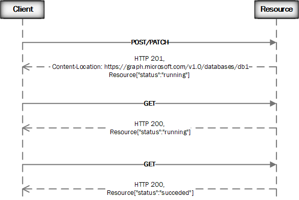
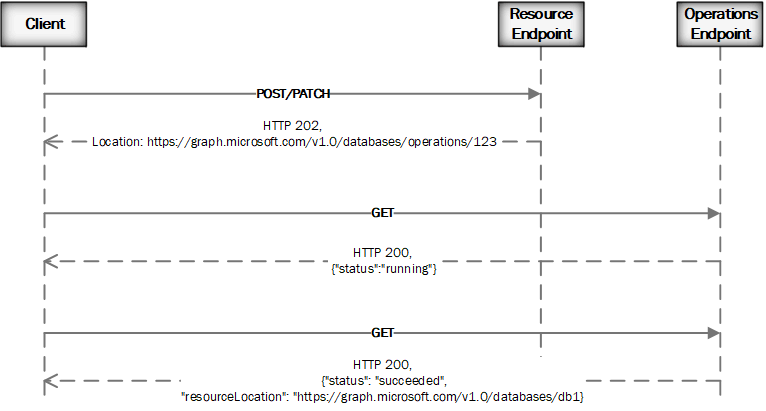

# Long running operations

Microsoft Graph API Design Pattern

*The long running operations (LRO) pattern provides the ability to model operations where processing a client request takes a long time, but the client isn't blocked and can do some other work until operation completion.*

## Problem

The API design requires modeling operations on resources, which takes a long time
to complete, so that API clients don't need to wait and can continue doing other
work while waiting for the final operation results. The client should be able to
monitor the progress of the operation and have an ability to cancel it if
needed.

The API needs to provide a mechanism to track the work
being done in the background. The mechanism needs to be expressed in the same
web style as other interactive APIs. It also needs to support checking on the status and/or
being notified asynchronously of the results.

## Solution

The solution is to model the API as a synchronous service that returns a
resource that represents the eventual completion or failure of a long running
operation.

There are two flavors of this solution:

- The returned resource is the targeted resource and includes the status of
  the operation. This pattern is often called RELO (resource-based long running operation).

<!-- markdownlint-disable MD033 -->
<p align="center">
  
</p>
<!-- markdownlint-enable MD033 -->

- The returned resource is a new API resource called *stepwise operation* and is created to track the status. This LRO solution is similar to the concept of Promises or Futures in other programming languages.

<!-- markdownlint-disable MD033 -->
<p align="center">
  
</p>
<!-- markdownlint-enable MD033 -->

The RELO pattern is the preferred pattern for long running operations and should be
used wherever possible. The pattern avoids complexity, and consistent resource
presentation makes things simpler for our users and tooling chain.

- For the RELO pattern, you should return the Location header that indicates the location of the resource.
  - The API response says the targeted resource is being created by returning a 201 status code and the resource URI is provided in the Location header, but the response indicates that the request is not completed by including "Provisioning" status.

- For the LRO pattern, you should return the Location header that indicates the location of a new stepwise operation resource.
  - The API response says the operation resource is being created at the URL provided in the Location header and indicates that the request is not completed by including a 202 status code.
  - Microsoft Graph doesn’t allow tenant-wide operation resources; therefore, stepwise operations are often modeled as a navigation property on the target resource.

- For most implementations of the LRO pattern (like the example above), there will be 3 permissions necessary to comply with the principle of least privilege: `ArchiveOperation.ReadWrite.All` to create the `archiveOperation` entity, `ArchiveOperation.Read.All` to track the `archiveOperation` entity to completion, and `Archives.Read.All` to retrieve the `archive` that was created as a result of the operation.
For APIs that would have been modeled as a simple `GET` on the resource URL, but that are modeled as long-running operations due to MSGraph performance requirements, only the `Archive.Read.All` permission is necessary as long as creating the `archiveOperation` entity is "safe".
Here, "safe" means that there are no side effects of creating the `archiveOperation` entity that would change the functionality of any entities outside of the `archive` being retrieved.
This requirment does not mean that the API must be idempotent, but an idempotent API is suffucient to meet this requirement.

## When to use this pattern

Any API call that is expected to take longer than one second in the 99th percentile should use the long running operations pattern.

How do you select which flavor of LRO pattern to use? An API designer can follow these heuristics:

1. If a service can create a resource with a minimal latency and continue updating its status according to the well-defined and stable state transition model until completion, then the RELO model is the best choice.

2. Otherwise, a service should follow the stepwise operation pattern.
 
## Issues and considerations

- One or more API consumers MUST be able to monitor and operate on the same resource at the same time.

- The state of the system SHOULD always be discoverable and testable. Clients
    SHOULD be able to determine the system state even if the operation tracking
    resource is no longer active. Clients MAY issue a GET on some resource to
    determine the state of a long running operation.

- The long running operations pattern SHOULD work for clients looking to "fire and forget"
    and for clients looking to actively monitor and act upon results.

- The long running operations pattern might be supplemented by the [change notification pattern](./change-notification.md).

- Cancellation of a long running operation does not explicitly mean a rollback. On a per API-defined case, it
    might mean a rollback or compensation or completion or partial completion,
    etc. Following a canceled operation, the API should return a consistent state that allows
    continued service.

- A recommended minimum retention time for a stepwise operation is 24 hours.
    Operations SHOULD transition to "tombstone" for an additional period of time
    prior to being purged from the system.
    
- Services that provide a new operation resource MUST support GET semantics on the operation.
- Services that return a new operation MUST always return an LRO (even if the LRO is created in the completed state); that way API consumers don't have to deal with two different shapes of response.

## Examples

### Create a new resource using RELO

A client wants to provision a new database:

```
POST https://graph.microsoft.com/v1.0/storage/databases/

{
  "displayName": "Retail DB",
}
```

The API responds synchronously that the database has been created and indicates
that the provisioning operation is not fully completed by including the
Content-Location header and status property in the response payload:

```
HTTP/1.1 201 Created
Location: https://graph.microsoft.com/v1.0/storage/databases/db1

{
  "id": "db1",
  "displayName": "Retail DB",
  "status": "provisioning",
  [ … other fields for "database" …]
}
```

The client waits for a period of time, and then invokes another request to try to get the database status:

```
GET https://graph.microsoft.com/v1.0/storage/databases/db1

HTTP/1.1 200 Ok
{
  "id": "db1",
  "displayName": "Retail DB",
  "status": "succeeded",
  [ … other fields for "database" …]
}
```

### Cancel RELO operation

A client wants to cancel provisioning of a new database:

```
DELETE https://graph.microsoft.com/v1.0/storage/databases/db1

```

The API responds synchronously that the database is being deleted and indicates
that the operation is accepted and is not fully completed by including the
status property in the response payload. The API might provide a
recommendation to wait for 30 seconds:

```
HTTP/1.1 202 Accepted
Retry-After: 30

{
  "id": "db1",
  "displayName": "Retail DB",
  "status": "deleting",
  [ … other fields for "database" …]
}
```

The client waits for a period of time, and then invokes another request to try to get the deletion status:

```
GET https://graph.microsoft.com/v1.0/storage/databases/db1

HTTP/1.1 404 Not Found
```
### Create a new resource using the stepwise operation

```
POST https://graph.microsoft.com/v1.0/storage/archives/

{
  "displayName": "Image Archive",
  ...
}
```

The API responds synchronously that the request has been accepted and includes
the Location header with an operation resource for further polling:

```
HTTP/1.1 202 Accepted

Location: https://graph.microsoft.com/v1.0/storage/operations/123

```

### Poll on a stepwise operation

```

GET https://graph.microsoft.com/v1.0/storage/operations/123
```

The server responds that results are still not ready and optionally provides a
recommendation to wait 30 seconds:

```
HTTP/1.1 200 OK
Retry-After: 30

{
  "createdDateTime": "2015-06-19T12-01-03.4Z",
  "lastActionDateTime": "2015-06-19T12-01-03.45Z",
  "status": "running"
}
```

The client waits the recommended 30 seconds and then invokes another request to get
the results of the operation:

```
GET https://graph.microsoft.com/v1.0/storage/operations/123
```


The server responds with a "status:succeeded" operation that includes the resource
location:

```
HTTP/1.1 200 OK

{
  "createdDateTime": "2015-06-19T12-01-03.45Z",
  "lastActionDateTime": "2015-06-19T12-06-03.0024Z",
  "status": "succeeded",
  "resourceLocation": "https://graph.microsoft.com/v1.0/storage/archives/987"
}
```

### Trigger a long running action using the stepwise operation

```
POST https://graph.microsoft.com/v1.0/storage/copyArchive

{
  "displayName": "Image Archive",
  "destination": "Second-tier storage"
...
}
```

The API responds synchronously that the request has been accepted and includes
the Location header with an operation resource for further polling:

```
HTTP/1.1 202 Accepted

Location: https://graph.microsoft.com/v1.0/storage/operations/123

```
