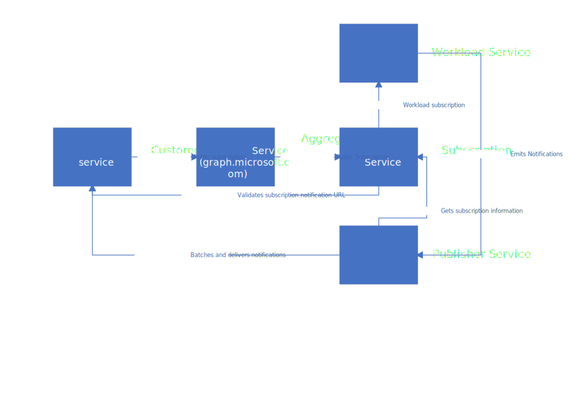
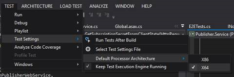

# Adding support for Change Notifications

Microsoft Graph Change Notifications enables application to subscribe to resource changes happening across Microsoft Graph without having to continuously poll the API for changes. Change notifications can be delivered to the subscriber either via webhooks (the subscriber exposes a notification URL) or via Azure Events Hub (first party only at the moment). For an overview of the general concept, please [refer to the public documentation](https://docs.microsoft.com/en-us/graph/webhooks).

## Why should you add change notifications support for your entities?

There are different scenarios where customers need to trigger custom logic execution based on changes in Microsoft Graph. These scenarios range from updating UI to reflect changes in the Graph to scenarios that need to analyze data (e.g. DLP, compliance, line of business apps...).
Today, if your API surface does not support change notifications, the only avenue for customers to implement such scenarios is by **continuously query your API surface**. This increases the complexity and cost of such solutions for customers or makes implementing certain scenarios impossible at scale. More importantly, it greatly increases COGS for the Microsoft Graph as well as your API.

## Architectural overview



The diagram above documents a simplified overview of the service components involved in the change notifications infrastructure:

- **Customer web service**: this service is owned by he customer (or subscriber). It creates and renews subscriptions by calling Microsoft Graph and receives change notifications.
- **Aggregator Service**: this service is the publicly exposed service that customer applications query. (aka Microsoft Graph, AGS)
- **Subscription Service**: this middleware service _acts as a workload_ from the AGS' perspective and _looks like the AGS_ from a workload's perspective. This service is owned by the Microsoft Graph Change Tracking Team and performs the following tasks:
  - Receives and responds to any incoming `/subscriptions` request from the AGS.
  - Maintains a store of subscriptions.
  - Validates the `notificationUrl` during subscription creation.
  - Validates the `notificationUrl` performance on regular basis.
  - Coordinates subscriptions CRUD operations with workloads by calling workloads APIs.
- **Publisher Service**: this service receives any notification emitted by workloads, batches multiple notifications to the same notification URL, and delivers notifications. This service also handles retrying delivery when the subscriber's notification URl is slow and/or not available. This service is owned by the Microsoft Graph Change Tracking Team.
- **Workload Service**: this service is the target workload's own API. It maintain it's local subscription store, implements an API for subscriptions CRUD operations and emits notifications.

## How to add support for change notifications for your entity types

### Update the public documentation

1. Add your resource to [the table of permissions](https://docs.microsoft.com/en-us/graph/api/subscription-update?view=graph-rest-beta&tabs=http#permissions). This needs to be done for [Get](https://docs.microsoft.com/en-us/graph/api/subscription-get?view=graph-rest-beta&tabs=http#permissions), [Create](https://docs.microsoft.com/en-us/graph/api/subscription-post-subscriptions?view=graph-rest-beta&tabs=http#permissions), [Update](https://docs.microsoft.com/en-us/graph/api/subscription-update?view=graph-rest-beta&tabs=http#permissions) and [Delete](https://docs.microsoft.com/en-us/graph/api/subscription-delete?view=graph-rest-beta&tabs=http#permissions) (\*).
1. Add the maximum expiration time entry [in the table](https://docs.microsoft.com/en-us/graph/api/resources/subscription?view=graph-rest-beta#maximum-length-of-subscription-per-resource-type) (\*).
1. Add the example [resource paths](https://docs.microsoft.com/en-us/graph/api/subscription-post-subscriptions?view=graph-rest-beta&tabs=http#example) (\*).
1. Add the resource in the [overview page](https://docs.microsoft.com/en-us/graph/api/resources/webhooks?view=graph-rest-beta) as well as a [permission](https://docs.microsoft.com/en-us/graph/api/resources/webhooks?view=graph-rest-beta#permissions) (\*).
1. Add an entry into [supported resources](https://docs.microsoft.com/en-us/graph/webhooks#supported-resources) on the concept page (\*\*).
1. Add an entry in the [change log](https://docs.microsoft.com/en-us/graph/changelog), [guidance](../../Document/Guidelines/Changelog)
1. Add an entry in the [latency table](https://docs.microsoft.com/en-us/graph/webhooks#latency) (\*\*).

> \*: These pages are available for beta and v1.0, make sure you update the beta pages during the public preview of change notifications support for your API. Make sure you update v1.0 pages when support ships for general availability. Updates for different versions can be done in different pull request.

> \*\*: Make sure you include a (preview) next to your resource name during the public preview of change notifications support for your API. Make sure you remove the (preview) once the support for change notifications is generally available.

### Provide required information to support

In order to provide proper support for our customers, the support teams need information you need to provide them with.

This information will be provided by starting a separate process owned by support called SPOT. To start the process, [create a new intake](https://microsoftspot.azurewebsites.net/Intake). A release manager will then contact you and guide you through the process of collecting and documenting the required information for support teams.

When creating the SPOT intake, make sure you indicate you are adding change notifications support for your workload and set the following fields:

- Disclosure level: No restrictions
- Release Type: Product/Service/Program
- Release Sub Type: Feature
- Responsible Org: Deployment Services
- Responsible Team: DS C+AI Team

In relevant links, add the [change notifications support wiki](https://supportability.visualstudio.com/AzureAD/_wiki/wikis/AzureAD/313638/Microsoft-Graph-Notifications-and-Change-Tracking-using-webhooks) `https://supportability.visualstudio.com/AzureAD/_wiki/wikis/AzureAD/313638/Microsoft-Graph-Notifications-and-Change-Tracking-using-webhooks`

Some of the information that support will require to add it to their internal documentation include:

- The ICM service and team for escalation
- The owning team (distribution list)

### Update the schema metadata

The subscription service relies on matching the subscription's resource property with Microsoft Graph schema metadata to understand which workload it should relay requests to. This process:

1. Gets the entity that matches the resource property.
1. Get the `ags:AddressUrl` property of that entity from the schema.
1. Uses the Fully Qualified Domain Name or hostname of the URL to determine which adapter to load.
1. Uses the adapter to determine the full URL of the workload's subscriptions API and call it.

You need to make sure you have:

1. An entity onboarded to Microsoft Graph and defined in the metadata
1. This entity has an `ags:AddressUrl` property defined.
1. This entity you are the workload that owns the entity (i.e. no `ags:IsMaster` attribute or the attribute is set to `true`).

> The entity referenced by a subscription may be hidden via `ags:IsHidden` if the entity is not a publicly available entity but needs to provide support for change notifications (first-party only scenarios).

If your entity does not meet the requirements listed above, you need to update the schema definition of your entity, or add your entity if it is not defined all together. Please refer to the [guidance](../../../Rollout/Publish-schema/Test-using-VSTS-repo)Test-using-VSTS-repo).

### Handle subscriptions CRUD operations

Subscriptions created by applications are maintained in two separate services, you must provide an API that supports CRUD operations for subscriptions and implement an adapter in the Microsoft Graph subscription service that will relay calls to the former API as described below.

#### The workload's subscription service

This service is in charge of reflecting any operation on subscription relayed by the subscription service into the workloads data store. The API is usually collocated with the workload's API. The API you are building to implement subscriptions CRUD operations at a workload's level should be as close as possible to the [public-facing API](https://docs.microsoft.com/en-us/graph/api/resources/subscription?view=graph-rest-beta) to limit the need for payload transformations. You should also consider the following points:

- Requests to GET existing subscriptions are not proxied to the workload, these are served by the Subscription Store service directly.
- When authorizing requests from the Subscription Store service, the actor of the PFT will be the subscription store service, not AGS.
- The Subscription Store service will use your service's DNS name as the resource URI when requesting tokens, so this needs to be registered on your first-party app.
- For POST operations, the Microsoft Graph Subscription Service will substitute the following properties that were provided by the client:
  - `notificationUrl`: replaced by the URL of the Publisher Service that the workload should use to submit new notifications.
    > This new URL is region specific allowing the workload to send notifications to the publisher in the corresponding region. Should the URL change for any reason, the Subscription Service will delete and re-create subscriptions for the workload by calling the workload's subscription service.
  - `clientState`: replaced by a randomly generated one in order to protect the customer's service.

> The subscription and publisher services will also replace the subscription id provided by the workload with a unified subscription id generated by the subscription service during the subscription creation.

#### The Microsoft Graph Subscription Service

This service is in charge of maintaining the integrity of subscriptions across internal services (Microsoft Graph and workloads) and coordinates calls to workloads stores to do so. For the subscription store to be aware of new resources that can be subscribed to and start relaying CRUD operations to the workload's, you need to implement an adapter in the **Subscription Service**:

- You can see a sample of such implementation [on our repository](https://dev.azure.com/msazure/One/_git/AD-AGSChangeTracking/commit/39038e51f9f9c57481e21d32c7b3243920de9163).
- You must specify your workload's application id in the Subscription Publisher service's configuration for tokens to be accepted.
- When submitting the pull request:
  1. Share workload contacts: dev owner alias, dev group alias, and ICM service and team.
  1. Assign members of aadctdevs as reviewers.

To get started with the repository:

1. Fork the [AD-AGSChangeTracking](https://dev.azure.com/msazure/One/_git/AD-AGSChangeTracking) repository (you only need the master branch, More instructions on fork can be found [here](https://dev.azure.com/msazure/Forks)).
1. Clone your fork to your local machine.
1. Open a shell as admin and navigate to the newly cloned repository.
1. Run `init.cmd`.
1. Run `init.cmd -createshortcut`, this will create a shortcut on your desktop.
1. Open the shortcut as an administrator.
1. Navigate to `/src/dev/Notifications` (cd).
1. Run `vsmsbuild dirs.proj` to open the projects in Visual Studio.

> This repository is built on top of coreXT practices, for more information on how to get started, please refer to the [documentation](https://microsoft.sharepoint.com/teams/corext/LivingDocs/Home.aspx)

To get the tests running locally:

1. Request the Graph Subscription team to grant you permissions to the `graphwebhooks-Test` Azure KeyVault. (see [How to get help](#how-to-get-help) to request it on Teams.)
1. Update the default processor architecture to x64:

   1. In Visual Studio select `Test Settings`.
   1. Then select `Default Processor Architecture`.
   1. Then select `X64`.

   

> 'build' must be run from the src/dev/notifications folder. Any test failures must be re-run in visual studio. A couple tests fail intermittently, running those multiple times should result in all passing. StyleCop failures must be addressed.

> Visual studio 2019 is required. Open the project: src/dev/Notifications> vsmsbuild dirs.proj

#### OData query parameters

By default the subscription service will forward OData query parameters in the resource property. It is up to the workload to decide whether they want to support those or not.

If the workload decides not to support OData query parameters, it should return a valid OData error that explicitly calls out the fact that OData query parameters are not supported for that resource. The subscription service will respond to the initial request with the provided error.

If the workload decides to support OData query parameters, it should implement those:

- **\$filter**: if the entity emitting the filter, a notification should be emitted, if not no notification should be emitted. e.g. for messages `$filter=IsRead eq 'true'` should only emit notifications when the `IsRead` property of the message is `true`. If no filter is provided, all notifications should be emitted given they match other conditions (changeType, ...).
- **\$select**: if the change is on a property included in the select statement, a notification should be emitted. If the change is not on a property included no notification should be emitted. If no select is provided, all notifications should be emitted given they match other conditions (changeType, ...).
- **\$top**: not supported in this context.
- **\$orderby**: not supported in this context.
- **\$expand**: not supported in this context.
- **\$count**: not supported in this context.
- **\$format**: not supported in this context.
- **\$search**: not supported in this context.
- **\$skip**: not supported in this context.

### Send notifications to the publisher service

You must send any notification to the publisher service's using the `notificationUrl` (POST) that was provided by the Microsoft Graph Subscription Service during the subscription creation.

The notification URL will require an `Authorization` request header with the following value `Bearer <bearertoken>` where the bearer token is an app-only JWT obtained from EvoSTS for the Microsoft Graph Change Tracking App Id as audience (0bf30f3b-4a52-48df-9a82-234910c4a086).

> Note: you need to app your app id in the publisher configuration as outlined in the Pull Request sample provided in [The Microsoft Graph Subscription Service](#the-microsoft-graph-subscription-service) section.

Here is an example payload publishing one notification.

```json
{
  "Value": [
    {
      "@odata.type": "#Microsoft.OutlookServices.Notification",
      "Id": null,
      "SubscriptionExpirationDateTime": "2019-02-14T23:56:30.1307708Z",
      "ChangeType": "created",
      "subscriptionId": "MTE1MTVlYTktMjVkZS00MjY3LWI1YzYtMjg0NzliZmRhYWQ2",
      "resource": "https://outlook.office365.com/api/beta/Users('userId@tenantId')/Events('<event id>')",
      "clientState": "WebhooksSubscriptionState1",
      "resourceData": {
        "Id": "<event id>",
        "@odata.etag": "<tag id>",
        "@odata.id": "https://outlook.office365.com/api/beta/Users('userId@tenantId')/Events('<event id>')",
        "@odata.type": "#Microsoft.OutlookServices.Event",
        "OtherResourceData": "some other resource data",
        "OtherResourceData2": "some other resource data 2"
      }
    }
  ]
}
```

| Property Path                  | Description                                                                                                                                                                          | Required | Type   |
| ------------------------------ | ------------------------------------------------------------------------------------------------------------------------------------------------------------------------------------ | -------- | ------ |
| @odata.type                    | OData Type of the notification as represented on the workload                                                                                                                        | Yes      | String |
| Id                             | Unique Id for notification                                                                                                                                                           | No       | String |
| SubscriptionExpirationDateTime | Expiration Date and time of the subscription                                                                                                                                         | Yes      | String |
| ChangeType                     | Change type of the resource represented by the notification (created,updated,deleted)                                                                                                | Yes      | String |
| SubscriptionId                 | Internal subscription Id as used by the workload, the Publisher Service will translate it to a public subscription Id for the subscriber                                             | Yes      | String |
| Resource                       | Resource URL on Microsoft Graph. Only exception for Exchange where the Publisher Service translates the value.                                                                       | Yes      | String |
| ClientState                    | Client state associated with the subscription                                                                                                                                        | Yes      | String |
| resourceData.id                | Resource Id on Microsoft Graph.                                                                                                                                                      | Yes      | String |
| resourceData.@odata.id         | Resource URL on Microsoft Graph. Only exception for Exchange where the Publisher Service translates the value.                                                                       | Yes      | String |
| resourceData.@odata.etag       | Opaque string representing the state of the resource as specified [here](https://docs.microsoft.com/en-us/openspecs/windows_protocols/ms-odata/c4d715eb-10f6-47fa-9ccc-2ebf926558a6) | No       | String |
| resourceData.@odata.type       | Resource type as represented on Microsoft Graph. Only exception for Exchange.                                                                                                        | Yes      | String |
| resourceData.OtherResourceData | Additional properties to be attached. Should not contain customer data unless you are implementing rich notifications (see below)                                                    | No       | Any    |

> The maximum number of notifications that can be sent at once is 100. Notifications for different subscriptions or tenants can be batched in the same call to the publisher service.

### Life cycle notifications (preview)(optional)

Life cycle notifications allow subscribers to get additional notifications whenever a change impacting the subscription itself occurs. When receiving a life cycle notification, subscribers can choose to try to auto-remedy the issue and/or let the end user know that an action is required from them. This feature is currently in public preview and you can learn more about it's usage in the [public documentation](https://docs.microsoft.com/en-us/graph/webhooks-lifecycle).

You should always send life cycle notifications if you choose to implement them. Subscribers will receive them only if they provide an additional `lifecycleNotificationUrl` during subscription creation (POST).

Life cycle notifications must be delivered to the `notificationUrl`. They do not include any resource data and must include a `changeType` property (string) for which the valid values are:

- `missed`: notifications have not been sent to the subscriber because of a resource change, the subscriber should get the latest version of the resource from Microsoft Graph.
- `subscriptionRemoved`: the subscription has been deleted by the workload either because the resource itself has been deleted (e.g. a user left the company, the corresponding mailbox has been archived and the subscriptions to the mailbox have been deleted) or because of compliance issues (user's password reset, device out of compliance...). The subscriber should try to get the latest version of the resource from Microsoft Graph and if it still exists, subscribe again. The publisher service will delete the subscription from the subscription service automatically upon reception of such notification.
- `reauthorizationRequired`: the subscription notifications are still delivered to the publisher service by the workload, but the publisher service is holding them until the subscriber completes an [authorization challenge](https://docs.microsoft.com/en-us/graph/webhooks-with-resource-data#authorization-challenge-flow). If the subscriber fails to complete the challenge before the subscription's expiration time, notifications are dropped and the subscription is deleted. If the subscriber completes the authorization challenge in time, pending notifications are delivered. This is automatically generated by the publisher service to ensure that subscribers are still in compliance with access policies when delivering rich notifications (see below).

> If the list of event types above does not cover your scenario, please let us know (see How to get help), the specification and public documentation allows for introducing new event types. The additional values cannot be any of `created`, `updated` or `deleted` as those values are reserved for classic notifications.

> The `changeType` property will be renamed to `lifecycleEvent` by the publisher service before being delivered to subscribers so it matches the publicly documented schema.

## Rich notifications (preview)

Rich notifications, publicly known as [change notifications with resource data](https://docs.microsoft.com/en-us/graph/webhooks-with-resource-data), build on the foundation of change notifications. The major difference between rich notifications and basic notifications being that rich notifications include changed data with the notification delivered to the subscriber. This allows subscribers to understand change context without having to query Microsoft Graph saving them implementation efforts, latency and also saving us COGS. All implementation details provided by basic notifications still apply to rich notifications.

### Handling rich notifications subscription CRUD requests

Rich notification subscriptions are created the same way as basic notifications subscriptions. In addition to properties documented in the [Handle subscriptions CRUD operations](#handle-subscriptions-crud-operations) section, you'll receive the property `includeResourceData` set to `true` as an indicator that the subscriber wants to receive data with the notifications. If the resource does not support sending data, you must return an error.

> Note: if you decide to encrypt the resource data before sending it to the publisher service (see below), you will also receive the following additional properties: `encryptionCertificate` which is a base64 encoded certificate public key, `encryptionCertificateId` which is a subscriber-defined identifier for the certificate and must be attached with the encrypted content.

> Note: if you decide to encrypt the resource data before sending it to the publisher service (see below), you also need to handle `encryptionCertificate` and `encryptionCertificateId` updates on PATCH requests.

### Encrypting changes notifications with resources payload

The changed data attached to the notification is always encrypted when delivered to the subscriber. This ensures that under any circumstances the data will not be compromised or tampered with.

Workloads have two main choices when it comes to encrypting the data:

- You can delegate the encryption work to the publisher service, simply add any data property to the resourceData object. The publisher will take any property that is not whitelisted (id, odata.type, odata.id), remove them from the resourceData object and create the encrypted content with it.
- You can implement the encryption of the content yourself before submitting the notification to the publisher service. This is especially useful when you must respect data privacy and/or residency standards as it ensures that nobody else besides the workload and the subscriber can read the data.

The choice should be carefully considered ahead of time as there's no migration plan in place today that supports changing "who encrypts the payload" once notifications start being sent.

The encryption boundary is determined by the `RichNotificationsPayloadEncryptionEnabledForWorkloads` setting in the publisher service configuration. When your workload name is in the list of values, the publisher service will encrypt any data attached with the notification. Otherwise, the publisher service expects data to be encrypted prior to receiving the notification from the workload.

#### Encrypting resource data on workload

Should you choose to encrypt the payload, we provide a [utility class](https://dev.azure.com/msazure/One/_git/AD-AGSChangeTracking?path=%2Fsrc%2Fdev%2FNotifications%2FNotifications.Azure%2FEncryptor%2FEncryptor.cs&version=GBmaster) that helps you encrypt the content, the key and generate the signature. To get this library add the `Microsoft.Online.AggregatorService.Encryptor` from our [nuget feed](https://dev.azure.com/msazure/One/_packaging?_a=feed&feed=Official).

> Note: the library is only available for dotnet standard today.

The library will return 3 out of 5 required properties to add to the `encryptedContent` object:

- `data`: the encrypted (using the single-use generated symmetric key) and base64 encoded representation of the JSON value you provided as input.
- `dataSignature`: the HMAC-SHA256 the digital signature of the `data` value.
- `dataKey`: the encrypted (using the subscriber's provided public key) and base64 encoded single-use generated symmetric key to be used to validate signature and decrypt the `data`.

You are also required to add the following properties to the `encryptedContent` object before attaching it to the notification object:

- `encryptionCertificateId`: the subscriber generated identified for the certificate provided during the subscription creation.
- `encryptionCertificateThumbprint`: the digital thumbprint of the certificate used for encryption of the single-use generated symmetric key.

> The data, before it's encrypted, must be a JSON object with the same schema public schema of the entity the notification is emitted for. If any **\$select** query parameter is included with the resource property of the subscription object, only properties included in the select statement should be included. For more informations refer to [OData query parameters](#odata-query-parameters).

Here is an example payload publishing one notification which contains encrypted content.

```json
{
  "Value": [
    {
      "subscriptionId": "c9101526-927a-4eec-95dd-f45683a97c6d",
      "changeType": "Created",
      "@odata.type": "#Microsoft.Graph.ChatMessage",
      "clientState": "ClientSecret",
      "subscriptionExpirationDateTime": "2018-05-20T18:23:45.9356913+00:00",
      "resource": "teams('7434c182-5c07-418a-8116-5945d043b179')/channels('19:8da7bc05bc4e4e5c9b75b2cfe65124dc@thread.skype')/messages('1540929866182')/replies('1540929866243')",
      "resourceData": {
        "id": "1532471292816",
        "@odata.type": "#Microsoft.Graph.ChatMessage",
        "@odata.id": "teams('7434c182-5c07-418a-8116-5945d043b179')/channels('19:8da7bc05bc4e4e5c9b75b2cfe65124dc@thread.skype')/messages('1540929866182')/replies('1540929866243')"
      },
      "EncryptedContent": {
        "data": "lSI1f79<abreviated>",
        "dataSignature": "<redacted>",
        "dataKey": "Xm6Ec/6v<abreviated>",
        "encryptionCertificateId": "c4f2788d-914a-4494-903a-57522477a9b0",
        "encryptionCertificateThumbprint": "78B664778B44CAECDFB11270E5549C1AD34AA0D9"
      }
    }
  ]
}
```

### Sending validation tokens

Because subscribers do not need anymore to query Microsoft Graph back upon receiving a rich notifications, and because they are exposing a publicly available URL, it is even more important for them to be able to validate the origin of notifications. It allows subscribers to avoid executing code on requests coming from potentially rogue actors. When delivering rich notifications the publisher subscriber will include an array of validation tokens on the notifications collection object. These tokens are JWTs valid for the subscribing application. **No action is required from the workload, they are added automatically.**

## Additional information

### Throttling behavior for subscriptions requests

As requests for subscriptions are transiting through the subscription service before coming to the workload, this might bypass any throttling configuration you might have setup at the AGS level to enforce for the rest of your API surface.

The subscription service defines throttling rules at the AGS level that will be enforced, which means the subscription service itself will not make more requests than it has defined at the AGS level to the workload. The latest values can be viewed [here](https://microsoftgraph.visualstudio.com/onboarding/_git/AGS-OnboardingAutomationPipeline?path=%2Fgraphags_Public.xml&version=GBThrottlingService&_a=contents) (search for throttle.aad.subscriptionservice) :

- POST, PUT, DELETE, PATCH - per appid, 2000 requests in 20 sec period.
- POST, PUT, DELETE, PATCH - per tenant per appid, 1000 requests in a 20 sec period.
- All other HTTP methods - per appid, 10000 requests in a 20 sec period.
- All other HTTP methods - per tenant, per appid, 5000 requests in a 20 sec period.

### End to end testing

#### Local development flow

If you are building the subscriptions CRUD API in your workload and you want to validate that it respects the expected contract on your local dev machine, you can leverage unit tests to perform such validation. :

- Navigate to the `src/dev/Notifications/ExtendedTests/ExtendedTests.EndToEnd/E2ETests.cs` class on your local copy of the service repository.
- Update the `ExchangeEndpointUrl` property value by the local URL of the API you are developing ([ref](https://dev.azure.com/msazure/One/_git/AD-AGSChangeTracking?path=%2Fsrc%2Fdev%2FNotifications%2FExtendedTests%2FExtendedTests.EndToEnd%2FE2ETests.cs&version=GBmaster&line=127&lineEnd=127&lineStartColumn=30&lineEndColumn=49&lineStyle=plain)).
- Run the tests.

> These unit tests are designed to work with mocked APIs and will send invalid access tokens, you should disable authorization for the subscriptions part of your API.

#### Service End-to-end testing

You can test the end to end scenario (creating a subscription, generating notifications, receiving notifications) in PPE. Once your code changes have been deployed on the workloads side and your pull request to the subscription/publisher service has been merged, you can request the on call engineer to deploy your build of the subscription/publisher service to PPE. The contact of the on call engineer can be found on [our ICM board](https://portal.microsofticm.com/imp/v3/oncall/current?serviceId=20330&teamIds=36748&scheduleType=timeline&shiftType=current&viewType=1).

You can also leverage [our public sample](https://github.com/microsoftgraph/aspnetcore-webhooks-sample) as a dummy service that will create and receive notifications.

### First-Party only notifications

Microsoft Graph change notifications provides support for notifications available only for first party applications.
The following table lists the resources available for subscription:

| Resource               | Description                                                                  |
| ---------------------- | ---------------------------------------------------------------------------- |
| AllTenantAssignedPlans | Triggers a notification whenever plans assignment are updated on any tenant. |
| AllTenantTenantDelete  | Triggers a notification whenever a tenant gets deleted.                      |
| AllTenantUserDelete    | Triggers a notification whenever a user gets deleted on any tenant.          |

#### How to create a first party subscription

1. [Create a subscription](https://docs.microsoft.com/en-us/graph/api/subscription-post-subscriptions?view=graph-rest-1.0&tabs=http) on the `users` resource with your first party application.
1. [Email the team](mailto:AADCTdevs@microsoft.com?body=Please%20fill%20in%20the%20following%20details:%0A-%20Resource:%20%0A-%20Environment:%20%0A-%20App%20ID:%0A-%20Subscription%20ID:%20&subject=Request%20for%20first%20party%20subscription) providing the following details:
   - Resource (from the table above)
   - Environment (PROD/public, PPE/public, Mooncake, US gov...)
   - App Id
   - Subscription ID

> **Note:** Due to the high volume of notifications you might receive, we recommend you leverage [Azure Event Hubs delivery](https://github.com/microsoftgraph/microsoft-graph-docs/pull/7462) instead of webhook delivery for the notifications.

## How to get help

Should you need any help during your design and implementation, there are a couple of ways you can reach out:

- [Stackoverflow.com](https://stackoverflow.com): for any question that does not contain confidential, internal or customer related information. Example: questions about ASP.NET core MVC, questions about the OData libraries, etc.
- [Internal StackOverflow](https://stackoverflow.microsoft.com): for any question that might contain confidential or internal information. Example: how do I configure the routing in AGS to do...
- [Teams: Microsoft Graph > Webhooks](https://teams.microsoft.com/l/channel/19%3a4139ee2d50a54a14a75365d505d27364%40thread.skype/Webhooks?groupId=6d279915-6f5d-452c-895b-7f4f82038843&tenantId=72f988bf-86f1-41af-91ab-2d7cd011db47): for any question that contains details really specific to your implementation, escalation of questions left unanswered on one of the StackOverflow platforms, ...

Ask: please refrain from asking questions directly to the engineering team via either emails, Teams chat etc... This does not scale and it doesn't capture the question (and answer) for other people that might have the same question as you. You should always try to ask a question on stack overflow first before reaching out on the Teams channel.
